# 黑马点评

## 1. 项目初始化

1. 首先去 `Github`上找黑马点评的资源（**前后端 + hmdp.sql**），资源链接：[cs001020/hmdp: 黑马点评](https://github.com/cs001020/hmdp)

2. 在本地创建项目文件夹hmdp存放前端后端项目代码
3. 用 hmdp 位置右键用终端打开，输入命令：`git clone -b init https://github.com/cs001020/hmdp.git`  克隆项目资源

4. 使用IDEA连接上`本地 mysql`数据库，新建名为hmdp的schema，并右键hmdp，选择SQL Scripts，在选择Run SQL Script...
5. `Redis` 我**在云服务器上** **用 Docker 部署**，先去阿里云放行 `6379` 端口（在本地也可以）

6. 执行 `docker pull redis:6.2` 拉取 **Redis 镜像**，然后使用 `docker images` 查看拉取是否成功

7. **运行容器实例**：`docker run -d --name redis-hmdp -p 6379:6379 -v /var/lib/redis/data:/data redis:6.2 --requirepass "123456" --appendonly yes`

8. 这里我们创建一个`application-local.yaml` ，来存放服务器IP，密码等**隐私数据**:（因为我们要把代码提交到github），并将`application-local.yaml` 添加到 `.gitignore` 表示**不提交到 github**

```yaml
# application-local.yaml
# 这个文件里写你真实的、敏感的私人数据
spring:
  datasource:
    # 如果本地数据库密码不是默认的，可以在这里覆盖
    password: xxx

redis:
  # 这里填阿里云服务器的真实公网 IP
  host: xxx
  # 这里填阿里云 Redis 的真实密码
  password: xxx
```

9. 然后修改 `application.yaml` 中与 `mysql` 和 `redis` 相关的配置并且 **激活 `application-local.yaml`**：

```yml
server:
  port: 8081
spring:
  application:
    name: hmdp
  datasource:
    driver-class-name: com.mysql.cj.jdbc.Driver
    url: jdbc:mysql://localhost:3306/hmdp?useSSL=false&serverTimezone=UTC
    username: root
    password: password_placeholder	# 占位，隐私数据处随便写，后续会被覆盖
  redis:
    host: your_server_ip		# 占位，后续被覆盖
    port: 6379
    password: your_password		# 占位
    lettuce:
      pool:
        max-active: 10
        max-idle: 10
        min-idle: 1
        time-between-eviction-runs: 10s
  jackson:
    default-property-inclusion: non_null # JSON处理时忽略非空字段
  profiles:
    active: local	# 激活local配置文件
mybatis-plus:
  type-aliases-package: com.hmdp.entity # 别名扫描包
logging:
  level:
    com.hmdp: debug
```

10. 由于我本地只装了jdk17，把 `pom.xml` 中的 **jdk版本改为17**

11. **启动**后端项目，访问  [localhost:8081/shop-type/list](http://localhost:8081/shop-type/list)  看是否有数据返回

12. 启动前端项目：**双击** nginx 文件夹下的 `nginx.exe` 即可，访问 http://localhost:8080/  看是否出现页面

13. **云服务器 Redis 常用指令**：

    - 启动 Redis Docker 容器：`docker run -d --name redis-hmdp -p 6379:6379 -v /var/lib/redis/data:/data redis:6.2 --requirepass "123456" --appendonly yes`

    - 进入 Redis 终端并指定密码：`docker exec -it redis-hmdp redis-cli -a 123456`
    - 获取所有的key：`keys *`
    - 查 String：`get 你的key名称`
    - 查 Hash：`hgetall 你的key名称`
    - 获取过期时间：`TTL 你的key名称`

## 2. 短信登录

### 2.1 基于Session实现

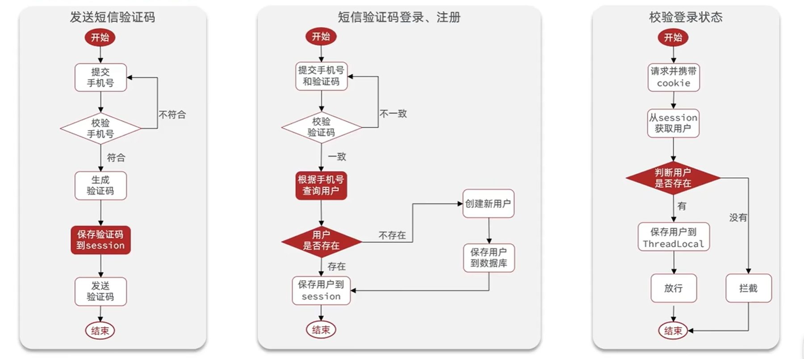

#### （1）短信验证码发送模块

1. `UserController 类`

```java
@PostMapping("code")
public Result sendCode(@RequestParam("phone") String phone, HttpSession session) {
    // 发送短信验证码并保存验证码
    return userService.sendCode(phone, session);
}
```

2. `IUserService 类`

```java
public interface IUserService extends IService<User> {
    Result sendCode(String phone, HttpSession session);
}
```

3. `UserServiceImpl 类`

```java
@Service
@Slf4j
public class UserServiceImpl extends ServiceImpl<UserMapper, User> implements IUserService {

    @Override
    public Result sendCode(String phone, HttpSession session) {
        // 检验手机号码
        if (RegexUtils.isPhoneInvalid(phone)) {
            // 手机号不符合
            return Result.fail("手机号码格式错误！");
        }

        // 手机号符合，生成验证码
        String code = RandomUtil.randomNumbers(6);

        // 保存验证码到session
        session.setAttribute("code", code);

        // 发送验证码
        log.debug("发送的验证码成功，验证码：{}", code);

        // 返回结果
        return Result.ok();
    }
}
```

#### （2）短信验证码登录和注册模块

```java
@Override
    public Result login(LoginFormDTO loginForm, HttpSession session) {

        // 检验手机号
        String phone = loginForm.getPhone();
        if (RegexUtils.isPhoneInvalid(phone)) {
            // 手机号不符合
            return Result.fail("手机号码格式错误！");
        }

        // 检验验证码
        String code = loginForm.getCode();
        Object cacheCode = session.getAttribute("code");
        if (cacheCode == null || !cacheCode.toString().equals(code)) {
            return Result.fail("验证码错误！");
        }

        // 根据手机号查询用户
        User user = query().eq("phone", phone).one();

        // 判断用户是否存在
        if (user == null) {
            // 5.不存在，创建新用户，并保存到数据库
            user = createUserWithPhone(phone);
        }

        // 保存用户到 session
        session.setAttribute("user", BeanUtil.copyProperties(user, UserDTO.class));

        return Result.ok();
    }

    private User createUserWithPhone(String phone) {
        // 创建用户
        User user = new User();
        user.setPhone(phone);
        user.setNickName(USER_NICK_NAME_PREFIX + RandomUtil.randomString(10));
        // 保存用户
        save(user);
        return user;
    }
}
```

**注意：**

- 1.要想使用 `mybaties-plus` 提供的CRUD方法，`service接口` 要`extends IService<User>`，`impl类` 要`extends ServiceImpl<UserMapper, User> implements IUserService`
- 2.这里的 `query()` 和 `save()` 就是 `mybaties-plus` 提供的CRUD方法
    - `eq` 写要查的字段，`one()` 表示获取一个值，`list()` 表示获取多个值并以list形式返回
    - `save()` 是向数据库中插入数据
- 3.Session 是**后端**的技术，它利用**前端**（Cookie）来存储一把钥匙，从而在**后端**维护用户的状态
    - `setAttribute()`：往session里**存入数据**
    - `getAttribute()`：从session中**取出数据**，使用注意**类型转换**
- 3.`Hutool`工具类的使用：
    - `BeanUtil` 是 `Hutool` 里面的一个工具类，`copyProperties()` 方法用于快速实现**对象间的属性拷贝**
    - `RandomUtil` 是 `Hutool` 里面的一个工具类
        - `randomString()` 方法用于**生成随机的字符串**，括号内传入生成长度
        - `randomNumbers()` 方法生成随机整数，括号内填长度
- 4.`RegexUtils` 是自己编写的工具类，里面编写了**快速检验是否合法**的规则

```java
public class RegexUtils {
    /**
     * 是否是无效手机格式
     * @param phone 要校验的手机号
     * @return true:符合，false：不符合
     */
    public static boolean isPhoneInvalid(String phone){
        return mismatch(phone, RegexPatterns.PHONE_REGEX);
    }
    /**
     * 是否是无效邮箱格式
     * @param email 要校验的邮箱
     * @return true:符合，false：不符合
     */
    public static boolean isEmailInvalid(String email){
        return mismatch(email, RegexPatterns.EMAIL_REGEX);
    }

    /**
     * 是否是无效验证码格式
     * @param code 要校验的验证码
     * @return true:符合，false：不符合
     */
    public static boolean isCodeInvalid(String code){
        return mismatch(code, RegexPatterns.VERIFY_CODE_REGEX);
    }

    // 校验是否不符合正则格式
    private static boolean mismatch(String str, String regex){
        if (StrUtil.isBlank(str)) {
            return true;
        }
        return !str.matches(regex);
    }
}
```

#### （3）登录校验拦截器模块

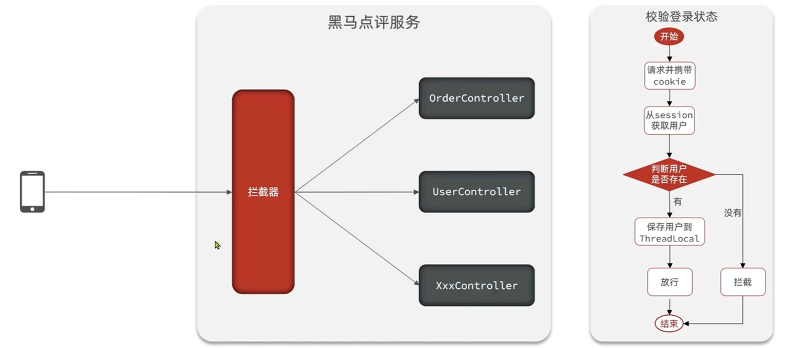

1. 新建一个包 `interceptor`存放所有的**拦截器**

2. 新建一个 `LoginInterceptor` 类，实现 `HandlerInterceptor` 接口，重写 `preHandle()` 和 `afterCompletion()` 方法

3. 编写代码如下：

```java
public class LoginInterceptor implements HandlerInterceptor {

    @Override
    public boolean preHandle(HttpServletRequest request, HttpServletResponse response, Object handler) throws Exception {

        // 获取 session
        HttpSession session = request.getSession();

        // 获取 当前用户信息
        Object user = session.getAttribute("user");

        // 判断用户是否存在
        if (user == null) {
            // 不存在，拦截，返回 401响应状态码
            response.setStatus(401);
            return false;
        }

        // 存在，保存用户信息到 ThreadLocal
        UserHolder.saveUser((UserDTO) user);

        // 放行
        return true;
    }

    @Override
    public void afterCompletion(HttpServletRequest request, HttpServletResponse response, Object handler, Exception ex) throws Exception {
        // 移除用户
        UserHolder.removeUser();
    }
}
```

4. 再完善 `UserController` 里面的 `me()` 方法

```java
@GetMapping("/me")
    public Result me(){
        // 获取当前登录的用户并返回
        UserDTO user = UserHolder.getUser();
        return Result.ok(user);
    }
```

5. 在config下面创建一个 `MvcConfig` 类
6. 编写代码如下：

```java
@Configuration
public class MvcConfig implements WebMvcConfigurer {

    // 添加拦截器
    @Override
    public void addInterceptors(InterceptorRegistry registry) {
        registry.addInterceptor(new LoginInterceptor())
                .addPathPatterns("/**")
                .excludePathPatterns(
                        "/user/code",
                        "/user/login",
                        "/upload/**",
                        "/blog/hot",
                        "/shop/**",
                        "/shop-type/**",
                        "/voucher/**"
                );
    }
}
```

**注意：**

-  1.`preHandle` ：**Controller**前置拦截；`postHandle`： **Controller**后置拦截；`afterCompletion`： 视图渲染之后返回给用户之前
- 2.编写拦截器时**重写方法快捷键**是 `ctrl + i`
- 3.拦截器内 **放行**就是 `return ture`，**拦截**就是 `return false`
- 4.**401** 响应状态码的含义是 **“未授权”**
- 5.`MvcConfig类` 用于实现**拦截器注册、资源映射、跨域配置**，创建好后需要 `implements WebMvcConfigurer`，加 `@Configuration`注解
- 6.添加拦截器是通过在 `MvcConfig` 里写 `addInterceptors()` 方法（打出**addIn**会有提示），在方法内通过 `registry` 的
    - `addInterceptor()`方法 进行**注册**，括号里传入**要注册的拦截器类的实例**；
    - `addPathPatterns()`方法设置**拦截的请求路径**，多个请求路径用 `,` 隔开，`/**` 表示所有
    - `excludePathPatterns()`方法设置**白名单**，即不拦截的请求路径
- 7.`ThreadLocal` 详解
    - `Tomcat` 的 **线程池机制** ：Web 服务器为了**高性能**，不会来一个请求就创建一个新线程（因为创建线程很贵），而是维护一个 **线程池**，线程干完活后，**不会死掉**，而是回到池子里休息，**等待下一次被分配****，**如果不清理**：线程回到池子里时，它的 `ThreadLocalMap` 里还装着 **上次的 存的信息**
    - 数据是存在 **线程对象自己**的身上的 `ThreadLocalMap`，`ThreadLocal` 仅仅是一个工具
    - 一定要在拦截器的 `afterCompletion` 方法里调用 `remove()` ，否则会发生**内存泄露**
- 8.该项目封装了一个 `UserHolder类`，用于实现将 `User类` 存入`ThreadLocal`，代码如下：

```java
public class UserHolder {
    private static final ThreadLocal<UserDTO> tl = new ThreadLocal<>();

    public static void saveUser(UserDTO user){
        tl.set(user);
    }

    public static UserDTO getUser(){
        return tl.get();
    }

    public static void removeUser(){
        tl.remove();
    }
}
```

- 9.`userDTO类` 用于**隐藏用户敏感信息**，以及**减少内存占用**：

```java
@Data
public class UserDTO {
    private Long id;
    private String nickName;
    private String icon;
}
```

- **DTO **主要用于**数据进来**（前端传参给后端）或者**内部传输**（Service 层之间）
- **VO** 主要用于**数据出去**（后端返回给前端展示）

### 2.2 session共享问题分析

**session共享问题：**多台Tomcat不共享session存储空间，当请求切换到不同tomcat服务时导致数据丢失的问题

对此，我们使用 `Redis` 解决

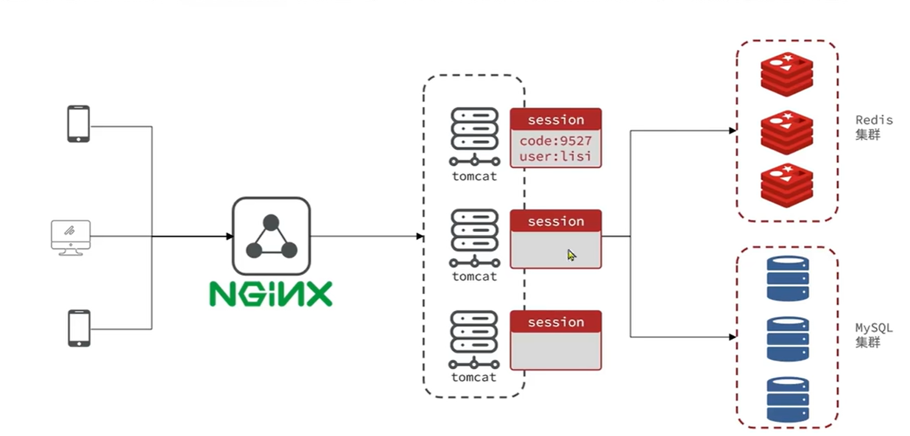

### 2.3 基于Redis实现

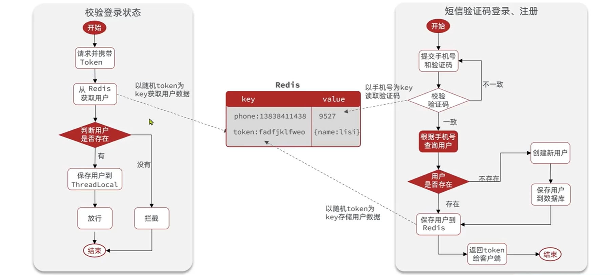

#### （1）前端代码编写使得每次请求都会携带 token

```js
// login.html 文件
axios.post("/user/login", this.form)
        .then(({data}) => {
            if(data){
              // 保存 token 到 浏览器
              sessionStorage.setItem("token", data);
            }
            // 跳转到首页
            location.href = "/index.html"
        })
```

```js
//common.js	文件
// request拦截器，将用户token放入头中
let token = sessionStorage.getItem("token");
axios.interceptors.request.use(
  config => {
    if(token) config.headers['authorization'] = token		//向后端发送请求时将token放入请求头中
    return config										 	//请求头叫 authorization
  },
  error => {
    console.log(error)
    return Promise.reject(error)
  }
)
```

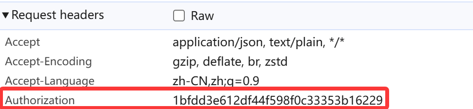

#### （2）修改`UserServiceImpl类`

1. 注入 `stringRedisTemplate`

```java
@Resource
private StringRedisTemplate stringRedisTemplate;
```

2. 保存验证码 到 Redis

```java
// 保存验证码到 Redis
stringRedisTemplate.opsForValue().set(LOGIN_CODE_KEY + phone, code,
                                      LOGIN_CODE_TTL, TimeUnit.MINUTES);
```

3. 从 Redis 中获取验证码

```java
// 从 Redis 中获取验证码
String cacheCode = stringRedisTemplate.opsForValue().get(LOGIN_CODE_KEY + phone);
```

4. 保存用户到 Redis

```java
// 保存用户到 Redis
// 随机生成 token，作为登录令牌
String token = UUID.randomUUID().toString(true);
// 将 User 对象转为 HashMap 存储
UserDTO userDTO = BeanUtil.copyProperties(user, UserDTO.class);
// 在存之前把 属性值 转成 String类型，因为 Redis 只能存 String类型
Map<String, Object> userMap = BeanUtil.beanToMap(userDTO, new HashMap<>(),
        CopyOptions.create()
                .setIgnoreNullValue( true)
                .setFieldValueEditor((fieldName, fieldValue) -> fieldValue.toString ()));
// 保存数据到 Redis
String tokenKey = LOGIN_USER_KEY + token;
stringRedisTemplate.opsForHash().putAll(tokenKey, userMap);
// 设置 token 过期时间
stringRedisTemplate.expire(tokenKey, LOGIN_USER_TTL, TimeUnit.MINUTES);
// 返回 token
return Result.ok(token);
```

**完整代码如下：**

```java
@Service
@Slf4j
public class UserServiceImpl extends ServiceImpl<UserMapper, User> implements IUserService {

    @Resource
    private StringRedisTemplate stringRedisTemplate;

    @Override
    public Result sendCode(String phone, HttpSession session) {
        // 检验手机号码
        if (RegexUtils.isPhoneInvalid(phone)) {
            // 手机号不符合
            return Result.fail("手机号码格式错误！");
        }

        // 手机号符合，生成验证码
        String code = RandomUtil.randomNumbers(6);

        // 保存验证码到 Redis
        stringRedisTemplate.opsForValue().set(LOGIN_CODE_KEY + phone, code, LOGIN_CODE_TTL, TimeUnit.MINUTES);

        // 发送验证码
        log.debug("发送的验证码成功，验证码：{}", code);

        // 返回结果
        return Result.ok();
    }

    @Override
    public Result login(LoginFormDTO loginForm, HttpSession session) {

        // 检验手机号
        String phone = loginForm.getPhone();
        if (RegexUtils.isPhoneInvalid(phone)) {
            // 手机号不符合
            return Result.fail("手机号码格式错误！");
        }

        // 检验验证码
        // 从 Redis 中获取验证码
        String cacheCode = stringRedisTemplate.opsForValue().get(LOGIN_CODE_KEY + phone);
        String code = loginForm.getCode();
        if (cacheCode == null || !cacheCode.toString().equals(code)) {
            return Result.fail("验证码错误！");
        }

        // 根据手机号查询用户
        User user = query().eq("phone", phone).one();

        // 判断用户是否存在
        if (user == null) {
            // 5.不存在，创建新用户，并保存到数据库
            user = createUserWithPhone(phone);
        }

        // 保存用户到 Redis
        // 随机生成 token，作为登录令牌
        String token = UUID.randomUUID().toString(true);
        // 将 User 对象转为 HashMap 存储
        UserDTO userDTO = BeanUtil.copyProperties(user, UserDTO.class);
        // 在存之前把 属性值 转成 String类型，因为 Redis 只能存 String类型
        Map<String, Object> userMap = BeanUtil.beanToMap(userDTO, new HashMap<>(),
                CopyOptions.create()
                        .setIgnoreNullValue( true)
                        .setFieldValueEditor((fieldName, fieldValue) -> fieldValue.toString ()));
        // 保存数据到 Redis
        String tokenKey = LOGIN_USER_KEY + token;
        stringRedisTemplate.opsForHash().putAll(tokenKey, userMap);
        // 设置 token 过期时间
        stringRedisTemplate.expire(tokenKey, LOGIN_USER_TTL, TimeUnit.MINUTES);
        // 返回 token
        return Result.ok(token);
    }

    private User createUserWithPhone(String phone) {
        // 创建用户
        User user = new User();
        user.setPhone(phone);
        user.setNickName(USER_NICK_NAME_PREFIX + RandomUtil.randomString(10));
        // 保存用户
        save(user);
        return user;
    }
}
```

**注意：**

- 1. `Redis` 中的**对象存储**，本项目使用第二种：`Hash结构`

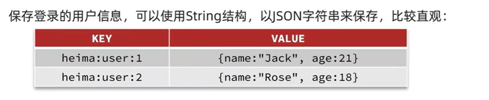

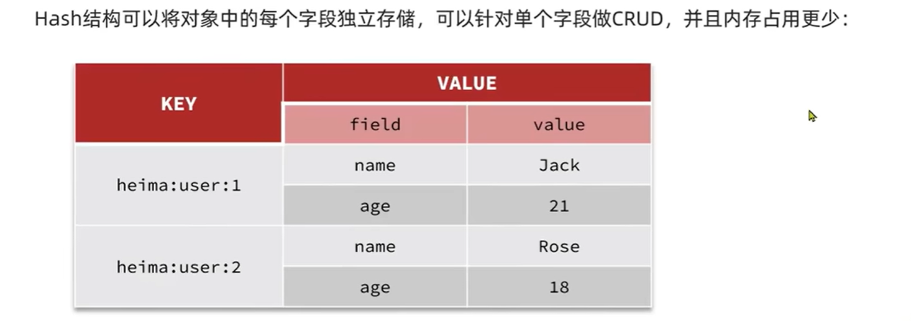

- 2.`Redis` 的 `stringRedisTemplate` 存储信息的**方法详解**

    - 它的 Key 和 Value **默认都使用 String 序列化方式**，不管存什么对象，都需要先转成 **字符串（通常是 JSON）** 才能存进去

    - `opsForValue()` ：String (字符串)，常规缓存

        - **存入**数据 (默认不过期)：`stringRedisTemplate.opsForValue().set("name", "Jack");`
        - 存入数据并**设置过期时间**：`stringRedisTemplate.opsForValue().set("login:code:13800138000", "1234", 2, TimeUnit.MINUTES);`
        - **获取**数据：`stringRedisTemplate.opsForValue().get("name");`

    - `opsForHash()` ：Hash (哈希)，存对象(字段拆分)
        - **存入单个**字段 (修改用户的名字)：`stringRedisTemplate.opsForHash().put("user:100", "name", "Rose");`
        - **存入整个 Map**（注意：Map 的 Key 和 **Value 必须都是 String 类型**！有时需要处理数据类型）：`stringRedisTemplate.opsForHash().putAll("login:token:xxxx", userMap);`
        - 获取单个字段：`stringRedisTemplate.opsForHash().get("user:100", "name");`
        - 获取所有字段：`stringRedisTemplate.opsForHash().entries("login:token:xxxx");`

    - 通用操作 (直接对 Key 操作)，属于某个具体的数据类型，是直接在 `stringRedisTemplate` 上调用的

        - **设置过期**时间 ：`stringRedisTemplate.expire("login:token:xxxx", 30, TimeUnit.MINUTES);`
        - 获取剩余过期时间：`Long expire = stringRedisTemplate.getExpire("login:token:xxxx");`
        - 删除 Key：`stringRedisTemplate.delete("login:token:xxxx");`
        - 判断 Key 是否存在：`Boolean hasKey = stringRedisTemplate.hasKey("login:token:xxxx");`

- 3.`TimeUnit 类` 用法：

    - 及其方便的**表示时间单位**
        - `TimeUnit.MILLISECONDS` ：毫秒
        - `TimeUnit.SECONDS` ：秒
        - `TimeUnit.MINUTES` ：分钟

    - 时间**单位转换**
        - `long seconds = TimeUnit.HOURS.toSeconds(1);` ：把 1 小时 转换成 秒
        - `long millis = TimeUnit.DAYS.toMillis(1);` ：把 1 天 转换成 毫秒

    - 替代 Thread.sleep ，用于**线程休眠**
        - `TimeUnit.SECONDS.sleep(5);` ：暂停 5 秒

- 4.关于存到 `Redis` 之前把 `Map` 中的值都转为`String` 的操作

  ```java
   // 在存之前把 属性值 转成 String类型，因为 Redis 只能存 String类型
          Map<String, Object> userMap = BeanUtil.beanToMap(userDTO, new HashMap<>(),
                  CopyOptions.create()
                          .setIgnoreNullValue( true)
                          .setFieldValueEditor((fieldName, fieldValue) -> fieldValue.toString ()));
  ```

- 5.关于**常量类的抽取**：

  我们将有关Redis的**常量类进行统一封装**，使代码更加优雅：

  ```java
  public class RedisConstants {
      public static final String LOGIN_CODE_KEY = "login:code:";
      public static final Long LOGIN_CODE_TTL = 2L;
      public static final String LOGIN_USER_KEY = "login:token:";
      public static final Long LOGIN_USER_TTL = 30L;
  }
  ```


#### （3）修改拦截器 `LoginInterceptor类`

1. 通过**构造函数**注入 `StringRedisTemplate`

```java
// 注入 StringRedisTemplate，但这里不能获取，因为 StringRedisTemplate 是 SpringBoot 创建的
// 而拦截器是在 SpringBoot 启动之后创建的，所以这里获取不到
private StringRedisTemplate stringRedisTemplate;

// 通过构造函数获取 StringRedisTemplate
public LoginInterceptor(StringRedisTemplate stringRedisTemplate) {
    this.stringRedisTemplate = stringRedisTemplate;
}
```

2. 从请求头中获取 token

```java
// 从请求头中获取token
String token = request.getHeader("authorization");

// 判断 token 是否为空
if (StrUtil.isBlank(token)) {
    // 不存在，拦截，返回 401响应状态码
    response.setStatus(401);
    return false;
}
```

3. 获取用户信息

```java
// 基于 Token 获取 Redis中的用户信息
String tokenKey = LOGIN_USER_KEY + token;
Map<Object, Object> userMap = stringRedisTemplate.opsForHash()
        .entries(tokenKey);
```

4. 将查询到的 HashMap对象转为 UserDTO对象

```java
// 将查询到的 HashMap对象转为 UserDTO对象
UserDTO userDTO = BeanUtil.fillBeanWithMap(userMap, new UserDTO(), false);
```

5. 刷新token有效期

```java
// 刷新token有效期
stringRedisTemplate.expire(tokenKey, LOGIN_USER_TTL, TimeUnit.MINUTES);
```

**注意：**

- 1.关于 `StringRedisTemplate` **不能通过注解注入**的问题

因为 在配置类里是用 `new LoginInterceptor()` 手动创建了这个对象，而**不是交给 Spring 容器去创建的**，我们自己 `new` 出来的对象，Spring 容器默认是 **“看不见、管不着”** 的，自然就没法把 `StringRedisTemplate` 注入进去，所以在 `LoginInterceptor` 里面写 `@Autowired` 或 `@Resource` 是无效的，全是 `null`

但 `MvcConfig` 上面有 `@Configuration` 注解，它是 Spring 的正式员工，Spring 会把 `StringRedisTemplate` 给它

```java
@Configuration
public class MvcConfig implements WebMvcConfigurer {

    // 1. Spring 把 Redis 给 MvcConfig（这里可以用 @Resource 注入）
    @Resource
    private StringRedisTemplate stringRedisTemplate;

    @Override
    public void addInterceptors(InterceptorRegistry registry) {
        // 2. MvcConfig 亲手把 stringRedisTemplate 递给拦截器（通过构造器）
        registry.addInterceptor(new LoginInterceptor(stringRedisTemplate))
                .excludePathPatterns("/user/code", "/user/login");
    }
}
```

故 `LoginInterceptor` 拦截器通过构造函数接住这个 `stringRedisTemplate`

```java
public class LoginInterceptor implements HandlerInterceptor {
    
    // 声明但未复制
    private StringRedisTemplate stringRedisTemplate;

    // 3. 通过构造函数接住别人递过来的 stringRedisTemplate
    public LoginInterceptor(StringRedisTemplate stringRedisTemplate) {
        this.stringRedisTemplate = stringRedisTemplate;
    }
}
```

#### （4）修改 `MvcConfig类`

注入 `stringRedisTemplate`，保证 `LoginInterceptor` 能拿到 `stringRedisTemplate`

```java
@Configuration
public class MvcConfig implements WebMvcConfigurer {

    // 注入 stringRedisTemplate
    @Resource
    private StringRedisTemplate stringRedisTemplate;

    // 添加拦截器
    @Override
    public void addInterceptors(InterceptorRegistry registry) {
        registry.addInterceptor(new LoginInterceptor(stringRedisTemplate)) //传入，通过构造器创建
                .addPathPatterns("/**")
                .excludePathPatterns(
                        "/user/code",
                        "/user/login",
                        "/blog/hot",
                        "/shop/**",
                        "/shop-type/**",
                        "/upload/**",
                        "/voucher/**",
                        "/blog/liked",
                        "/blog/of/follow",
                        "/follow/**",
                        "/user/follow"
                );
    }
}
```

### 2.4 登录拦截器优化：解决登录状态刷新问题

只用一个拦截器，只有访问**需要登录状态**的页面，才能**刷新token有效期**

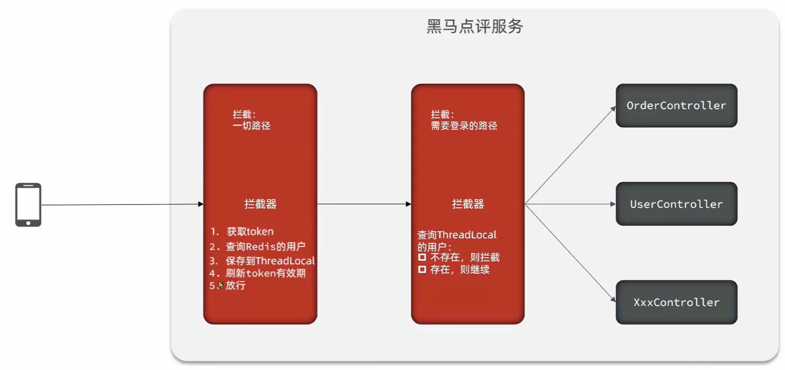

1. 新建一个拦截器，专门用于**处理登录状态刷新**，而不对请求进行拦截，全部放行（即 `return true`）

```java
public class RefreshTokenInterceptor implements HandlerInterceptor {

    // 注入 StringRedisTemplate，但这里不能获取，因为 StringRedisTemplate 是 SpringBoot 创建的
    // 而拦截器是在 SpringBoot 启动之后创建的，所以这里获取不到
    private StringRedisTemplate stringRedisTemplate;

    // 通过构造函数获取 StringRedisTemplate
    public RefreshTokenInterceptor(StringRedisTemplate stringRedisTemplate) {
        this.stringRedisTemplate = stringRedisTemplate;
    }


    @Override
    public boolean preHandle(HttpServletRequest request, HttpServletResponse response, Object handler) throws Exception {
        // 从请求头中获取token
        String token = request.getHeader("authorization");

        // 判断 token 是否为空
        if (StrUtil.isBlank(token)) {
            return true;
        }

        // 基于 Token 获取 Redis中的用户信息
        String tokenKey = LOGIN_USER_KEY + token;
        Map<Object, Object> userMap = stringRedisTemplate.opsForHash()
                .entries(tokenKey);


        // 判断用户是否存在
        if (userMap == null) {
            return true;
        }

        // 将查询到的 HashMap对象转为 UserDTO对象
        UserDTO userDTO = BeanUtil.fillBeanWithMap(userMap, new UserDTO(), false);

        // 存在，保存用户信息到 ThreadLocal
        UserHolder.saveUser(userDTO);

        // 刷新token有效期
        stringRedisTemplate.expire(tokenKey, LOGIN_USER_TTL, TimeUnit.MINUTES);

        // 放行
        return true;
    }

    @Override
    public void afterCompletion(HttpServletRequest request, HttpServletResponse response, Object handler, Exception ex) throws Exception {
        // 移除用户
        UserHolder.removeUser();
    }
}
```

2. 修改  `LoginInterceptor 类`的代码

```java
public class LoginInterceptor implements HandlerInterceptor {

    @Override
    public boolean preHandle(HttpServletRequest request, HttpServletResponse response, Object handler) throws Exception {
       // 判断是否需要拦截（ThreadLocal 中是否有用户）
        if (UserHolder.getUser() == null) {
            // 没有，拦截，返回401响应状态码
            response.setStatus(401);
            return false;
        }
        // 有用户，则放行
        return true;
    }

    @Override
    public void afterCompletion(HttpServletRequest request, HttpServletResponse response, Object handler, Exception ex) throws Exception {
        // 移除用户
        UserHolder.removeUser();
    }
}
```

3. 修改  `MvcConfig 类` 的代码

```java
@Configuration
public class MvcConfig implements WebMvcConfigurer {

    // 注入 StringRedisTemplate
    @Resource
    private StringRedisTemplate stringRedisTemplate;

    // 添加拦截器
    @Override
    public void addInterceptors(InterceptorRegistry registry) {
        //登录拦截器
        registry.addInterceptor(new LoginInterceptor())
                .addPathPatterns("/**")
                .excludePathPatterns(
                        "/user/code",
                        "/user/login",
                        "/blog/hot",
                        "/shop/**",
                        "/shop-type/**",
                        "/upload/**",
                        "/voucher/**",
                        "/blog/liked",
                        "/blog/of/follow",
                        "/follow/**",
                        "/user/follow"
                ).order(2);

        // 刷新token拦截器
        registry.addInterceptor(new RefreshTokenInterceptor(stringRedisTemplate))
                .addPathPatterns("/**")
                .order(1);  // 数字越小，优先级要高
    }
}
```

**注意：**

- 1.注册拦截器时通过 `order` 为拦截器设置优先级：**数字越小，优先级要高**，建议按照**运行排序数字**设置
- 2.注册拦截器时需要**传入拦截器的实例对象**：如 `registry.addInterceptor(new LoginInterceptor())`
- 每注册完一个拦截器都需要用 `;` 隔开

## 3. 缓存

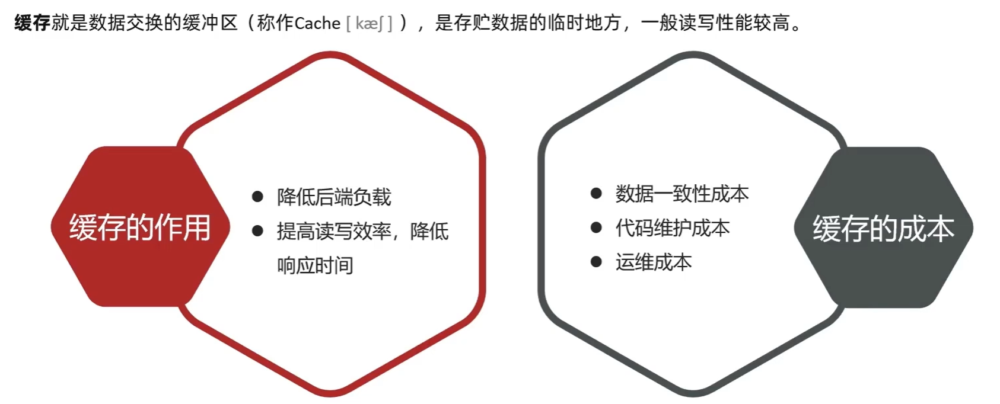

### 3.1 添加商户缓存


1. `ShopController 类`

```java
@GetMapping("/{id}")
public Result queryShopById(@PathVariable("id") Long id)
{
    return shopService.queryById(id);
}
```

2. `IShopService 类`

```java
public interface IShopService extends IService<Shop> {
    Result queryById(Long id);
}
```

3. `ShopServiceImpl 类`

```java
@Service
@Slf4j
public class ShopServiceImpl extends ServiceImpl<ShopMapper, Shop> implements IShopService {

    @Resource
    private StringRedisTemplate stringRedisTemplate;

    @Override
    public Result queryById(Long id) {
        // 从 Redis 中查询商铺缓存
        String shopKey = CACHE_SHOP_KEY + id;
        String shopJson = stringRedisTemplate.opsForValue().get(shopKey);
        // 命中，直接返回
        if (StrUtil.isNotBlank(shopJson)) {
            Shop shop = JSONUtil.toBean(shopJson, Shop.class);
            log.debug("命中了缓存");
            return Result.ok(shop);
        }
        // 未命中，根据 id 查数据库
        Shop shop = getById(id);
        // 数据库不存在，返回错误
        if (shop == null) {
            return Result.fail("店铺不存在");
        }
        // 存在，写入 Redis
        stringRedisTemplate.opsForValue().set(shopKey, JSONUtil.toJsonStr(shop));
        // 返回
        return Result.ok(shop);
    }
}
```

**注意：**

- 1.这里选择使用 `StringJSON` 的方式来 **存储对象**
- 2.`Hutool` 工具类的使用
    - `StrUtil` 的 `isNotBlank()` 方法 用于**快速判空**
    - `JSONUtil` 是 用于实现 `JSON字符串` 和 `对象` 之间的快速转换
        - `toBean()` ：JSON串 转回 对象
        - `toJsonStr()` ：对象 转成 JSON串
- `getById()` 是 `mybaties-plus` 的方法，用于快速实现查询

### 3.2 缓存更新策略

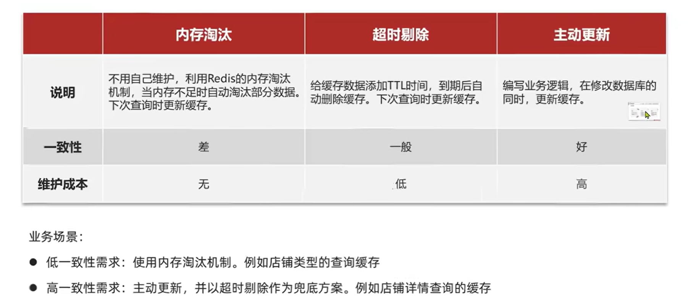

我们选择**主动更新策略：**

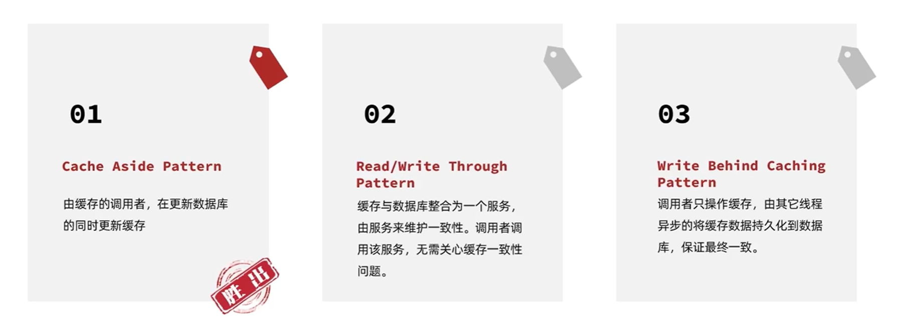

方法二和方法三目前没有好用的第三方组件并且实现较为复杂且一致性不如法一，因此我们选**方法一**

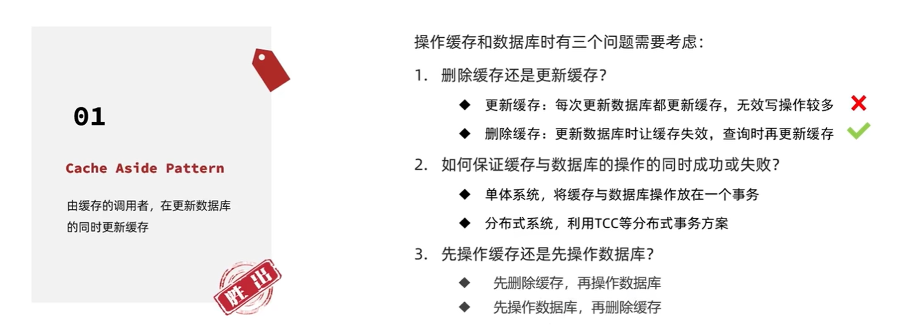

更新缓存存在很多**无效操作**，效率不高，我们采用**删除缓存**

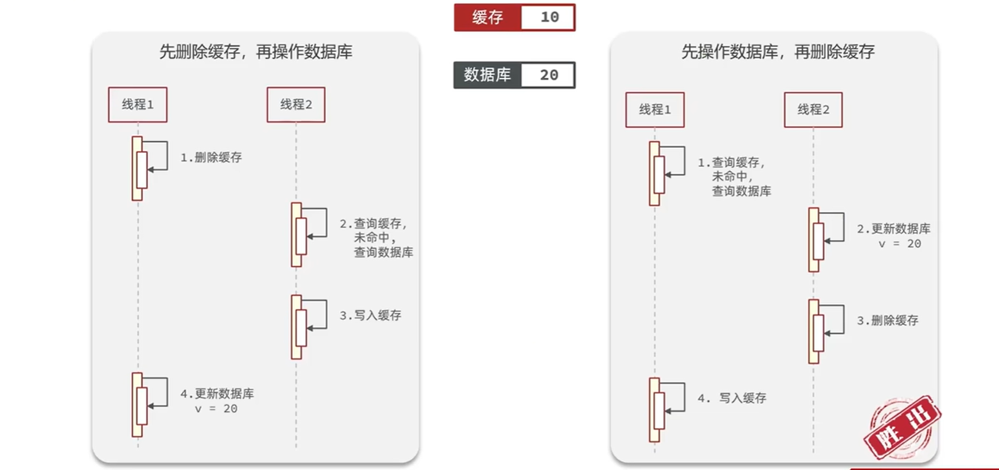

**先操作数据库再删除缓存**发生不一致性的可能性更低，因为**数据库操作的时间比缓存操作时间久**

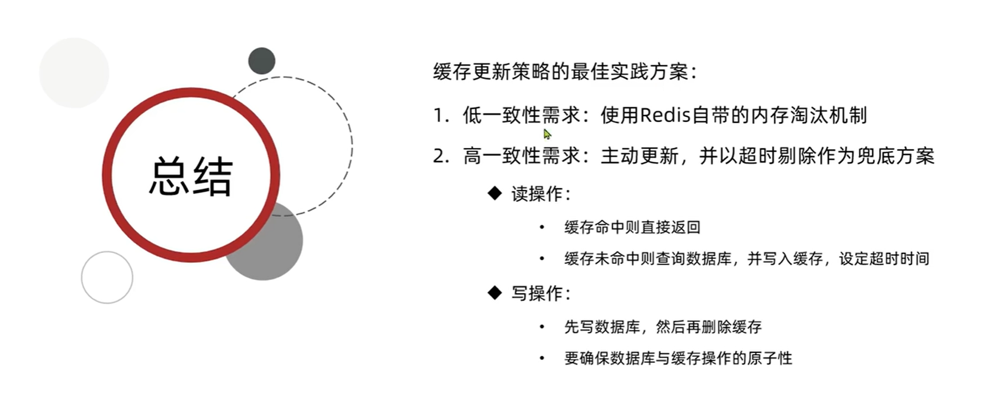

### 3.3 实现商户缓存和数据库的双写一致

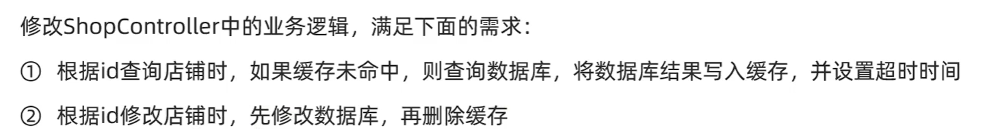

1. 存在，写入 Redis, 并设置缓存过期时间

```java
// 存在，写入 Redis, 并设置缓存过期时间
stringRedisTemplate.opsForValue().set(shopKey, JSONUtil.toJsonStr(shop),
        RedisConstants.CACHE_SHOP_TTL, TimeUnit.MINUTES);
```

2. 编写方法 update()，先更新数据库再删除缓存

```java
@Override
@Transactional  // 添加事务
public Result update(Shop shop) {
    Long id = shop.getId();
    if (id == null) {
        return Result.fail("店铺id不能为空");
    }
    // 更新数据库
    updateById(shop);
    // 删除缓存
    stringRedisTemplate.delete(CACHE_SHOP_KEY + id);

    return Result.ok();
}
```

**注意：**

- 1.添加事务只需要在类上面加 `@Transactional` 注解即可
- 2.这里用到了 `mybaties-plus` 自带的 `getId()` 方法和 `updateById()` 方法

### 3.4 缓存穿透

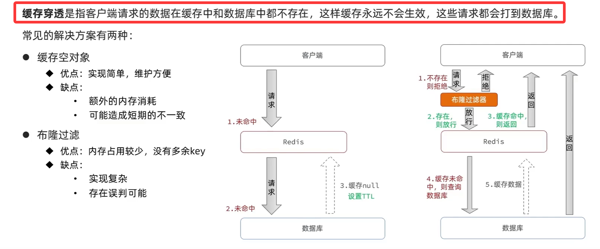

**缓存穿透**存在的问题 即如果有用户恶意访问，每次都**请求假数据**，会把我们服务器搞崩

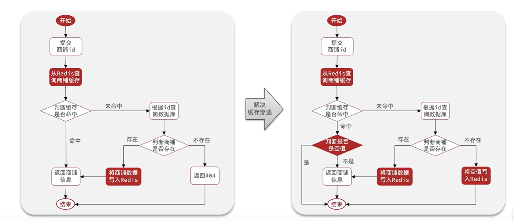

修改 `ShopServiceImpl` 的 `queryById()` 方法

1. 判断命中的是否是空值

```java
//判断命中的是否是空值
if (shopJson != null) {
    // 返回错误信息
    return Result.fail("店铺不存在");
}
```

2. 数据库中查不到数据时，将空值写入 Redis

```java
// 数据库不存在
if (shop == null) {
    // 将空值 写入 Redis
    stringRedisTemplate.opsForValue().set(shopKey, "", CACHE_NULL_TTL, TimeUnit.MINUTES);
    return Result.fail("店铺不存在");
}
```

完整代码：

```java
@Override
public Result queryById(Long id) {
    // 从 Redis 中查询商铺缓存
    String shopKey = CACHE_SHOP_KEY + id;
    String shopJson = stringRedisTemplate.opsForValue().get(shopKey);
    // 命中，直接返回
    if (StrUtil.isNotBlank(shopJson)) {
        Shop shop = JSONUtil.toBean(shopJson, Shop.class);
        log.debug("命中了缓存");
        return Result.ok(shop);
    }
    //判断命中的是否是空值
    if (shopJson != null) {
        // 返回错误信息
        return Result.fail("店铺不存在");
    }

    // 未命中，根据 id 查数据库
    Shop shop = getById(id);
    // 数据库不存在
    if (shop == null) {
        // 将空值 写入 Redis
        stringRedisTemplate.opsForValue().set(shopKey, "", CACHE_NULL_TTL, TimeUnit.MINUTES);
        return Result.fail("店铺不存在");
    }
    // 存在，写入 Redis, 并设置缓存过期时间
    stringRedisTemplate.opsForValue().set(shopKey, JSONUtil.toJsonStr(shop),
            RedisConstants.CACHE_SHOP_TTL, TimeUnit.MINUTES);
    // 返回
    return Result.ok(shop);
}
```

**注意：**

- `StrUtil` 的 `isNotBlank()` 方法只有当有值时才返回 `true`,  `""` 也会返回 `false`
- 查看一个**方法用法**的快捷键是 `ctrl + q`
- 查看一个**方法参数用法**的快捷键是 `ctrl + p`

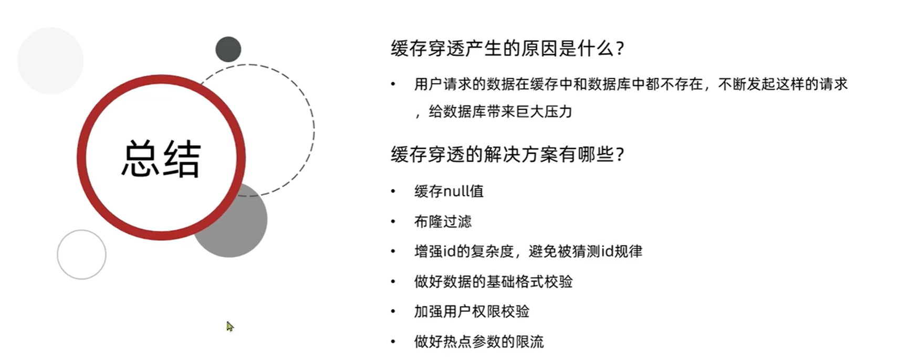

### 3.5 缓存雪崩

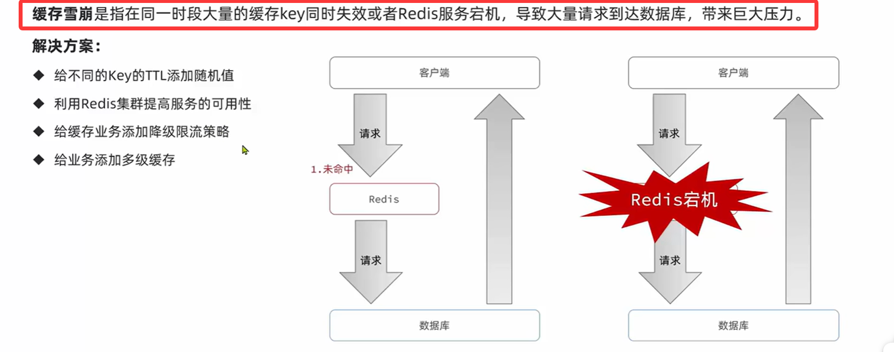

> 具体方法参考 spring cloud 黑马程序员虎哥的课程

### 3.6 缓存击穿（热点key）


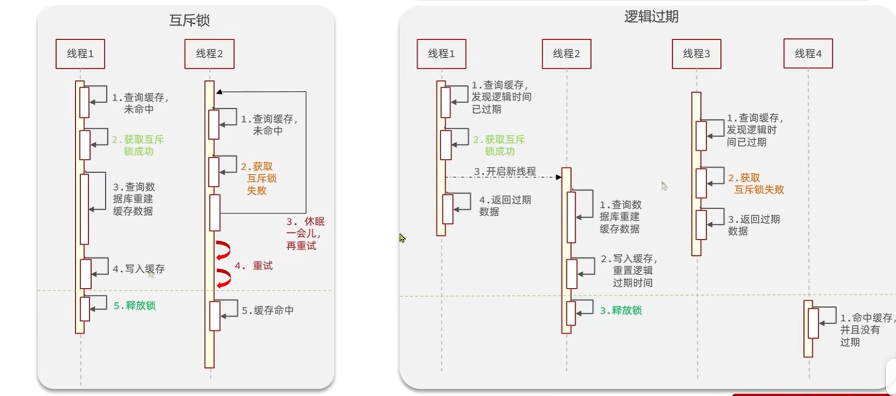

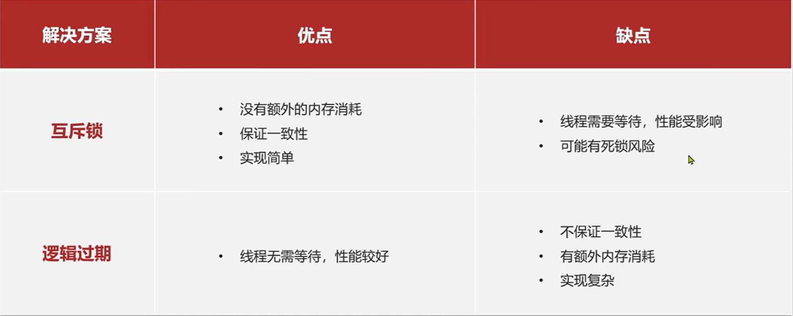

对于这两个方法的选择  即对于**一致性和可用性**之间的抉择

#### （1）基于互斥锁方式解决缓存击穿

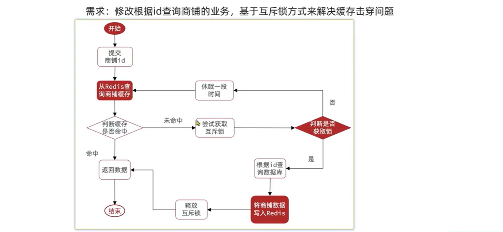

1. 编写获取锁方法 `tryLock()`

```java
// 尝试获取锁
private boolean tryLock(String key) {
    Boolean flag = stringRedisTemplate.opsForValue().setIfAbsent(key, "1", 10, TimeUnit.SECONDS);
    // Hutool 的 isTrue 会处理 null：如果是 null，直接返回 false，避免拆箱装箱问题
    return BooleanUtil.isTrue(flag);
}
```

2. 编写释放锁的方法 `unLock()`

```java
// 释放锁
private void unLock(String key) {
    stringRedisTemplate.delete(key);
}
```

3. 编写基于互斥锁解决缓存击穿的方法 `queryWithMutex()`

```java
//互斥锁解决缓存击穿
public Shop queryWithMutex(Long id) {
    // 从 Redis 中查询商铺缓存
    String shopKey = CACHE_SHOP_KEY + id;
    String shopJson = stringRedisTemplate.opsForValue().get(shopKey);
    // 命中，直接返回
    if (StrUtil.isNotBlank(shopJson)) {
        Shop shop = JSONUtil.toBean(shopJson, Shop.class);
        return shop;
    }
    //判断命中的是否是空值
    if (shopJson != null) {
        // 返回错误信息
        return null;
    }

    // 实现缓存重建
    // 获取互斥锁
    String lockKey = LOCK_SHOP_KEY + id;
    Shop shop = null;
    try {
        boolean isLock = tryLock(lockKey);
        // 判断是否获取锁成功
        if(!isLock){
            // 获取失败，休眠并重试，重试即递归
            Thread.sleep(50);
            return queryWithMutex(id);
        }

        // 获取锁成功，根据 id 查数据库
        // 根据 id 查数据库
        shop = getById(id);
        // 模拟延迟
        Thread.sleep(200);
        // 判断数据库中存不存在
        if (shop == null) {
            // 不存在，将空值 写入 Redis
            stringRedisTemplate.opsForValue().set(shopKey, "", CACHE_NULL_TTL, TimeUnit.MINUTES);
            return null;
        }
        // 存在，写入 Redis, 并设置缓存过期时间
        stringRedisTemplate.opsForValue().set(shopKey, JSONUtil.toJsonStr(shop),
                CACHE_SHOP_TTL, TimeUnit.MINUTES);
    } catch (InterruptedException e) {
        throw new RuntimeException(e);
    } finally {
        // 释放互斥锁，写到 finally 中
        unLock(lockKey);
    }

    // 返回
    return shop;
}
```

**注意：**

- 1.上锁的原理是基于 `Redis` 的 `setIfAbsent()` 方法，即只有 Redis 中**没有数据时**才进行插入
    - 这里我们锁的 key 值选择的是 `cache:shop:{商铺id}`
    - 上锁即向 Redis 中 写入数据，解锁即向 Redist 中删除对应数据
    - 解锁操作务必要在 `finally` 里进行，确保无论业务执行成功还是抛出异常，锁最终**都能被释放**
- `Hutool`  的 `isTrue()` 会自动处理 `null`：如果是 null，直接返回 false，避免**拆箱装箱**问题
- 获取锁失败，要进行**休眠**，休眠后**重新获取锁的操作是通过递归**来实现

#### （2）基于逻辑过期方式解决缓存击穿

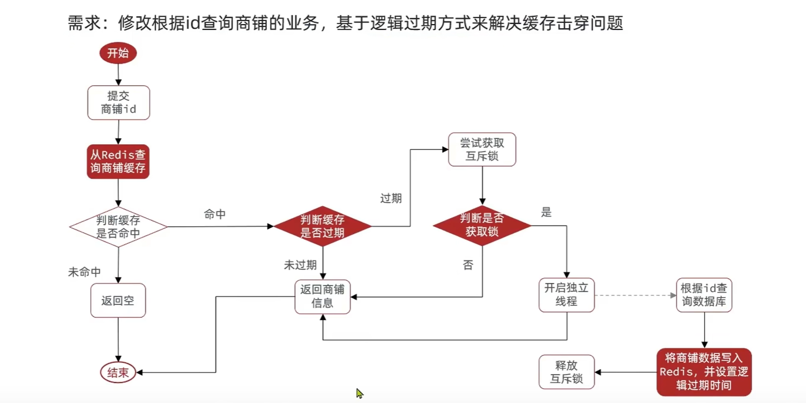

1. 编写方法 `saveShop2Redis()`：将商铺数据写入 Redis

```java
// 将商铺数据写入 Redis
private void saveShop2Redis(Long id, Long expireSeconds) throws InterruptedException {
    // 查询店铺信息
    Shop shop = getById(id);
    // 模拟缓存重建的延迟
    Thread.sleep(200);
    // 封装逻辑过期时间和村的数据
    RedisData<Shop> redisData = new RedisData();
    redisData.setData(shop);
    redisData.setExpireTime(LocalDateTime.now().plusSeconds(expireSeconds));
    // 写入 Redis
    stringRedisTemplate.opsForValue().set(CACHE_SHOP_KEY + id, JSONUtil.toJsonStr(redisData));
}
```

2. 创建线程池

```java
// 创建线程池
private static final ExecutorService CACHE_REBUILD_EXECUTOR = Executors.newFixedThreadPool(10);
```

3. 编写基于逻辑过期解决缓存击穿的方法 `queryWithMutex()`

```java
//逻辑过期解决缓存击穿
public Shop queryWithLogicExpire(Long id) {
    // 从 Redis 中查询商铺缓存
    String shopKey = CACHE_SHOP_KEY + id;
    String shopJson = stringRedisTemplate.opsForValue().get(shopKey);

    // 未命中，直接返回空
    if (StrUtil.isBlank(shopJson)) {
        return null;
    }

    // 命中，先json反序列化为对象
    RedisData<Shop> redisData = JSONUtil.toBean(shopJson, new TypeReference<RedisData<Shop>>() {},
            false);
    Shop shop = redisData.getData();
    LocalDateTime expireTime = redisData.getExpireTime();
    // 判断是否过期
    if (expireTime.isAfter(LocalDateTime.now())) {
        // 未过期，直接返回
        return shop;
    }

    // 已过期，进行缓存重建
    // 先尝试获取互斥锁
    String lockKey = LOCK_SHOP_KEY + id;
    boolean isLock = tryLock(lockKey);
    // 判断是否获取锁成功
    if(isLock){
        // 成功，开启独立线程，查数据库，存储到 Redis
        CACHE_REBUILD_EXECUTOR.submit(() -> {
            try {
                saveShop2Redis(id, 20L);
            } catch (Exception e) {
                throw new RuntimeException(e);
            } finally {
                // 释放锁
                unLock(lockKey);
            }
        });

    }

    // 获取锁失败，返回旧数据
    return shop;
}
```

**注意：**

- 1.为了添加一个**逻辑过期的字段**，我们新建了一个 `RedisData 类`
    - 这样处理的好处是不用动其他的实体类，**保持项目原始结构**
    - 我们通过**使用泛型**，避免进行**多次反序列化**
    - 要学会**泛型的语法**，一般来说，用 `T` 表示**输入类型**，`R`  表示**返回类型**，类的泛型写在类后面

```java
@Data
public class RedisData<T> {
    private LocalDateTime expireTime;   // 过期时间
    private T data;        // 要存的数据，使用泛型避免多次反序列化
}
```

- 2.判断是否过期是通过 `LocalDateTime` 实现的

    - 把过期时间设置为 `LocalDateTime.now().plusSeconds(expireSeconds)`，表示在**当前时间加上多少秒**
    - 判断时通过 `isAfter()` 判定， 即判断**过期时间是否在当前时间后面**，是则没过期

- 3.线程池详解

    - 实现**读写分离**，让耗时的重建操作异步化
    - `Executors.newFixedThreadPool(10);`：使用**固定大小**的线程池，**防止无限创建线程**耗尽内存
    - 提交任务通过 `线程池名字.submit( () -> {} )`，括号里面填的是**具体业务逻辑**，本项目的是缓存重建业务

  ```java
  // 1. 使用固定大小的线程池，防止无限创建线程耗尽内存
  private static final ExecutorService CACHE_REBUILD_EXECUTOR = 
      Executors.newFixedThreadPool(10); 
  
  // 2. 提交任务
  CACHE_REBUILD_EXECUTOR.submit(() -> {
      try {
          // 重建逻辑：查库 + 重设逻辑过期时间
          this.saveShop2Redis(id, expireSeconds); 
      } catch (Exception e) {
          throw new RuntimeException(e);
      } finally {
          // 3. 必须在子线程中释放锁！
          // 如果在主线程释放，由于主线程跑得快，可能还没重建完锁就没了
          unLock(lockKey); 
      }
  });
  ```

- 4.测试时我们会预先插入一条**逻辑已过期**的数据

### 3.7 封装 Redis 缓存工具类

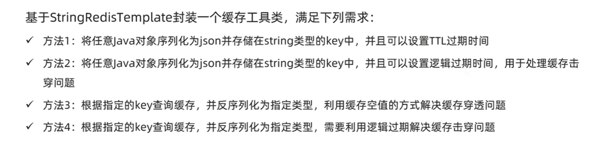

```java
@Component
public class CacheClient {

    @Resource
    private StringRedisTemplate stringRedisTemplate;

    // 设置缓存
    public void set(String key, Object value, Long time, TimeUnit unit) {
        stringRedisTemplate.opsForValue().set(key, JSONUtil.toJsonStr(value), time, unit);
    }

    // 设置缓存（逻辑过期）
    public <T> void setWithLogicExpire(String key, T value, Long time, TimeUnit unit) {
        // 设置逻辑过期时间和存储信息
        RedisData<T> redisData = new RedisData<>();
        redisData.setData(value);
        redisData.setExpireTime(LocalDateTime.now().plusSeconds(unit.toSeconds(time)));

        // 写入 Redis
        stringRedisTemplate.opsForValue().set(key, JSONUtil.toJsonStr(redisData));
    }

    // 缓存穿透的代码实现
    public <R, ID> R queryWithPassThrough(String keyPrefix, ID id, Class<R> type, Function<ID, R> dbFallback, Long time, TimeUnit unit) {
        // 从 Redis 中查询商铺缓存
        String key = keyPrefix + id;
        String json = stringRedisTemplate.opsForValue().get(key);
        // 命中，直接返回
        if (StrUtil.isNotBlank(json)) {
            return JSONUtil.toBean(json, type);
        }
        //判断命中的是否是空值
        if (json != null) {
            // 返回错误信息
            return null;
        }

        // 未命中，根据 id 查数据库
        R r = dbFallback.apply(id);
        // 数据库不存在
        if (r == null) {
            // 将空值 写入 Redis
            stringRedisTemplate.opsForValue().set(key, "", CACHE_NULL_TTL, TimeUnit.MINUTES);
            return null;
        }
        // 存在，写入 Redis, 并设置缓存过期时间
        set(key, r, time, unit);
        // 返回
        return r;
    }

    // 尝试获取锁
    private boolean tryLock(String key) {
        Boolean flag = stringRedisTemplate.opsForValue().setIfAbsent(key, "1", 10, TimeUnit.SECONDS);
        // Hutool 的 isTrue 会处理 null：如果是 null，直接返回 false，避免拆箱装箱问题
        return BooleanUtil.isTrue(flag);
    }

    // 释放锁
    private void unLock(String key) {
        stringRedisTemplate.delete(key);
    }

    // 创建线程池
    private static final ExecutorService CACHE_REBUILD_EXECUTOR = Executors.newFixedThreadPool(10);

    //逻辑过期解决缓存击穿
    public <R, ID> R queryWithLogicExpire(String lockPrefix,String keyPrefix, ID id, Class<R> type, Function<ID, R> dbFallback, Long time, TimeUnit unit) {
        // 从 Redis 中查询商铺缓存
        String key = keyPrefix + id;
        String json = stringRedisTemplate.opsForValue().get(key);

        // 未命中，直接返回空
        if (StrUtil.isBlank(json)) {
            return null;
        }

        // 命中，先json反序列化为对象
        RedisData redisData = JSONUtil.toBean(json, RedisData.class);
        JSONObject jsonObject = (JSONObject) redisData.getData();
        R r = BeanUtil.toBean(jsonObject, type);

        // 4. 获取过期时间
        LocalDateTime expireTime = redisData.getExpireTime();
        // 判断是否过期
        if (expireTime.isAfter(LocalDateTime.now())) {
            // 未过期，直接返回
            return r;
        }

        // 已过期，进行缓存重建
        // 先尝试获取互斥锁
        String lockKey = lockPrefix + id;
        boolean isLock = tryLock(lockKey);
        // 判断是否获取锁成功
        if(isLock){
            // 成功，开启独立线程，查数据库，存储到 Redis
            CACHE_REBUILD_EXECUTOR.submit(() -> {
                try {
                    // 查询数据库
                    R r1 = dbFallback.apply(id);
                    // 写入 Redis
                    setWithLogicExpire(key, r1, time, unit);
                } catch (Exception e) {
                    throw new RuntimeException(e);
                } finally {
                    // 释放锁
                    unLock(lockKey);
                }
            });

        }

        // 获取锁失败，返回旧数据
        return r;
    }
}
```

```java
@Override
public Result queryById(Long id) {
    // 缓存穿透
    // Shop shop = queryWithPassThrough(id);

    // 互斥锁解决 缓存击穿
    //Shop shop = queryWithMutex(id);

    //逻辑过期解决缓存击穿
    //Shop shop = queryWithLogicExpire(id);

    // 利用工具类解决缓存穿透
    //Shop shop = cacheClient.queryWithPassThrough(CACHE_SHOP_KEY, id, Shop.class, this::getById, CACHE_SHOP_TTL, TimeUnit.MINUTES);

    // 利用工具类解决缓存击穿
    Shop shop = cacheClient.queryWithLogicExpire(LOCK_SHOP_KEY ,CACHE_SHOP_KEY, id, Shop.class, this::getById, CACHE_SHOP_TTL, TimeUnit.MINUTES);

    // 返回
    if (shop == null) {
        return Result.fail("店铺不存在");
    }

    return Result.ok(shop);
}
```

> 这个工具类的编写，老师讲的非常好，对于编程思维很有启发，建议反复观看

**注意：**

- 1.编写工具类时最好**基于之前**写过的代码，要**善用泛型**，确定**需要传入**的参数
- 2.**方法**的泛型写在 **public 之后**
- 3.传入的**参数是函数**时
    - 格式：`Function<T，R> 函数名(参数)`，输入值泛型 `T`，在 返回结果泛型 `R` 前面
    - 调用时使用 `函数名.apply(参数)`

- 4.`JSON字符串` 反序列化为 Java对象 详解：

  在存入 Redis 时，Java对象还不是 `JSONObject`；只有当从 Redis 取出来并进行第一次反序列化时，它才自动变成了 `JSONObject`。 存入阶段：它是真正的 `Shop` 对象，此时 `redisData` 对象里的 `data` 属性指向的是一个真正的 `Shop` 实例对象。`JSONUtil.toJsonStr(redisData)` 会把整个对象转成一串标准的 JSON 字符串，Redis 库里存的是纯文本字符串，它不带任何 Java 类型信息。取出阶段：JSON 解析器读取字符串，看到 `data` 对应的值是一对大括号 `{...}`。解析器去看 `RedisData` 类的源码，发现 `data` 的类型定义是 `Object`（或者没指定泛型）。解析器不知道该把它转成 `Shop` 还是 `User`，为了不出错，就先把它转成了一个 **通用的键值对容器** ——`JSONObject` 。这是 JSON 框架 的 **默认行为**。由于 Java 的 **泛型擦除** 机制，运行时无法获知 `Object data` 到底应该匹配哪个实体类，**存的时候**：它是具体的，因为 Java 知道你塞进去的是 `Shop`，但**拿的时候**：它是模糊的，因为 `RedisData` 类只告诉程序这里有个 `Object`，因此当我们**通过泛型**明确 `Data` 的类型后，JSON框架就能够**知道要转换成什么类型**，这时就不会转成 `JSONObject` 了

```java
@Data
public class RedisData<T> {
  private LocalDateTime expireTime;   // 过期时间
  private T data;        // 要存的数据，使用泛型避免多次反序列化
}
```

```java
// 命中，先json反序列化为对象
    RedisData<Shop> redisData = JSONUtil.toBean(shopJson, new TypeReference<RedisData<Shop>>() {},
            false);
	Shop shop = redisData.getData();
```

`TypeReference` 只能捕获**写死**的泛型， 如果在泛型方法里写 `new TypeReference<T>(){}`，由于 `T` 本身在运行时就是未知的，所以 `TypeReference` 也无济于事，因此只能用 `JSONObject`

```java
 // 命中，先json反序列化为对象
    RedisData redisData = JSONUtil.toBean(json, RedisData.class);
    JSONObject jsonObject = (JSONObject) redisData.getData();
    R r = BeanUtil.toBean(jsonObject, type);
```

- 5.`TypeReference` 详解

    - `TypeReference` 是 Java JSON 序列化/反序列化库中为了解决 **泛型擦除（Type Erasure）** 而设计的一个核心工具类
    - 泛型只存在于编译期，一旦编译成 `.class` 文件，泛型就会被擦除
    - 基本语法：

  ```java
  // 重点在最后的 {}，表示创建一个匿名内部类
  new TypeReference<List<Shop>>() {}
  ```

    - 具体用法场景，**反序列化集合**和**反序列化带泛型的包装类**


## 4. 优惠卷秒杀

### 4.1 全局ID生成器

如果直接按照序号（自增）将ID插入到数据库中，返回给用户**规律太明显**：竞争对手只要今天下一个单 ID 是 100，明天下一个单 ID 是 200，就知道你一天卖了 100 单

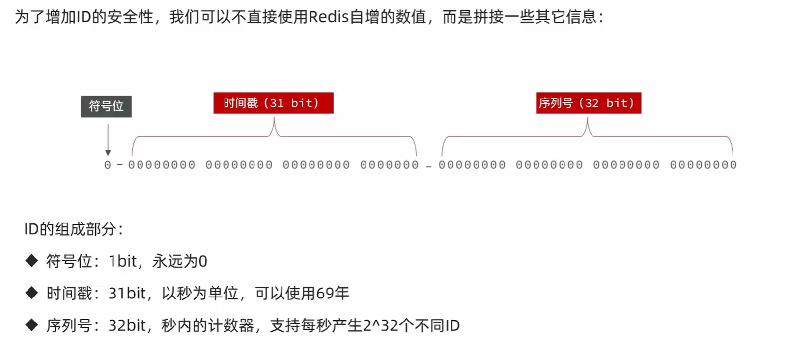

```java
/**
 * 全局 Redis ID生成器
 */
@Component
public class RedisIdWorker {

    @Resource
    private StringRedisTemplate stringRedisTemplate;

    /**
     * 基准时间的时间戳
     */
    private static final long BEGIN_TIMESTAMP = 1640995200L;

    /**
     * 序列号的位数
     */
    private static final long COUNT_BITS = 32;

    public Long nextId(String keyPrefix) {
        // 生成时间戳
        LocalDateTime now = LocalDateTime.now();
        long nowSecond = now.toEpochSecond(ZoneOffset.UTC);
        long timeStamp = nowSecond - BEGIN_TIMESTAMP;

        // 生成序列号
        // 获取当前日期，精确到天
        String date = now.format(DateTimeFormatter.ofPattern("yyyyMMdd"));
        long count = stringRedisTemplate.opsForValue().increment("icr:" + keyPrefix + ":" + date);
        // 拼接并返回

        return timeStamp << COUNT_BITS |  count;
    }

    public static void main(String[] args) {
        // 指定一个基准时间
        LocalDateTime time = LocalDateTime.of(2022, 1, 1, 0, 0, 0);
        long second = time.toEpochSecond(ZoneOffset.UTC);

        System.out.println("second = " + second);
        // 输出 1640995200
    }
}
```

**注意：**

- 1.`LocaldateTime` 详解
    - 是 Java 8 引入的新日期时间 API，**Local** 的意思是不包含“时区”信息。它只是一个单纯的时间描述，就像墙上的挂钟，写着“2022-01-01 00:00:00”，但它不知道这是北京时间还是伦敦时间
    - 创建对象（获取时间）
        - 获取当前系统时间：`LocalDateTime now = LocalDateTime.now();`
        - 指定**具体时间**：`LocalDateTime specific = LocalDateTime.of(2026, 1, 26, 12, 30, 0);`，参数为年月日时分秒
        - 解析字符串得到时间：`LocalDateTime parsed = LocalDateTime.parse("2026-01-26-12:30:00");`
    - 格式化与解析（String <-> Object）
        - 定义格式：`DateTimeFormatter formatter = DateTimeFormatter.ofPattern("yyyy-MM-dd HH:mm:ss");`
        - 【时间 -> 字符串】 (后端 -> 前端)：`String dateStr = now.format(formatter); `
        - 【字符串 -> 时间】 (前端 -> 后端)：`LocalDateTime dateTime = LocalDateTime.parse(input, formatter);`
    - 时间加减计算（推算时间）
        - 明天：`LocalDateTime tomorrow = now.plusDays(1);`
        - 上个月：`LocalDateTime lastMonth = now.minusMonths(1);`
        - 3天后的 2小时前：`LocalDateTime time = now.plusDays(3).minusHours(2);`
    - 获取具体字段
        - `int year = now.getYear();`
        - `int month = now.getMonthValue();`，注意：1就是1月，不像Date是从0开始的
    - 时间比较与判断
        - 判断早晚：
            - 还没开始？：`boolean isBefore = now.isBefore(start);`
            - 已经结束？：`boolean isAfter = now.isAfter(end);`
        - 判断相等：`boolean isEqual = now.isEqual(start);`
    - 转时间戳
        - 当前时间转秒级时间戳 (Redis ID 生成器在用) ：`long second = now.toEpochSecond(ZoneOffset.UTC);`
        - 当前时间转毫秒级时间戳 (系统存库常用)：`long milli = now.toInstant(ZoneOffset.of("+8")).toEpochMilli();`
        - 需要指定时区，`ZoneOffset.UTC` 是标准时，`ZoneOffset.of("+8")` 是北京时间
- 2.为什么按天分 key
    - 如果不按天区分，而是一个全局 Key 一直自增，一旦你的订单总数超过 42 亿，序列号溢出，ID 生成就会报错或重复
    - **按天分 Key (`icr:order:20260126`)**：意味着每一天你的序列号都**归零重算**
    - 方便统计业务数据，如**每天有多少单** 一目了然
- 3.`stringRedisTemplate` 的 `increment` 方法详解
    - 语法：
        - 基础版，加 1：`Long result = stringRedisTemplate.opsForValue().increment(String key);`
        - 进阶版：加 N (步长)：`stringRedisTemplate.opsForValue().increment(String key, long delta);`
        - 浮点版：加小数：`stringRedisTemplate.opsForValue().increment(String key, double delta);`
    - 细节：
        - 执行了 `increment`，数值变了，但它**依然会在剩下的时间内过期**，不会重置过期时间
        - 只要 Redis 服务正常，它返回的永远是具体的数字。但在 Java 中，由于自动拆箱机制，建议接收变量用包装类 `Long` 而不是基本类型 `long`，以防万一出现极端的空指针情况
        - **如果 Key 不存在**：Redis 会先将该 Key 的值初始化为 **0**，然后执行 `INCR` 操作，所以最终结果是 **1**，**如果 Key 存在**：直接将当前的值加 1，并返回相加后的新值
        - Redis 的 `increment` 是原子的，不管你有 1000 个线程还是 10000 个线程同时发起 `increment` 请求，它们到了 Redis 这里，必须**排队**，一个接一个地执行
- 4.**拼接**时的细节
    - 高位采用移位运算符，看前面要空多少个位置出来，就往左移位多少位
    - **或运算符**比**加**性能更高

### 4.2 实现秒杀下单

先往数据库**预插入秒杀卷**以供后续测试

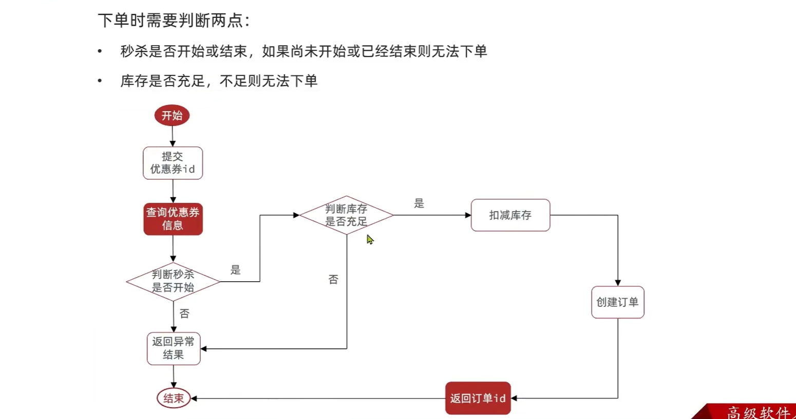

```java
@Resource
private ISeckillVoucherService seckillVoucherService;

@Resource
private RedisIdWorker redisIdWorker;

@Override
@Transactional  // 添加事务
public Result seckillVoucher(Long voucherId) {
    // 查询优惠卷信息
    SeckillVoucher voucher = seckillVoucherService.getById(voucherId);
    // 判断秒杀是否开始
    LocalDateTime beginTime = voucher.getBeginTime();
    if(beginTime.isAfter(LocalDateTime.now()))
    {
        return Result.fail("秒杀尚未开始");
    }
    // 判断秒杀是否结束
    LocalDateTime endTime = voucher.getEndTime();
    if(endTime.isBefore(LocalDateTime.now()))
    {
        return Result.fail("秒杀已结束");
    }
    // 判断库存是否充足
    Integer stock = voucher.getStock();
    if(stock < 1)
    {
        return Result.fail("库存不足");
    }
    // 扣减库存
    boolean success = seckillVoucherService.update()
            .setSql("stock = stock - 1")
            .eq("voucher_id", voucherId).update();

    if(!success) {
        return Result.fail("库存不足");
    }

    // 创建订单
    VoucherOrder voucherOrder = new VoucherOrder();
    // 订单ID
    Long orderId = redisIdWorker.nextId("order");
    voucherOrder.setId(orderId);
    // 用户ID
    Long userID = UserHolder.getUser().getId();
    voucherOrder.setUserId(userID);
    // 代金券ID
    voucherOrder.setVoucherId(voucherId);

    // 写入数据库，保存订单
    save(voucherOrder);

    // 返回订单id
    return Result.ok(orderId);
}
```

### 4.3 利用数据库的行锁（乐观锁）解决超卖问题

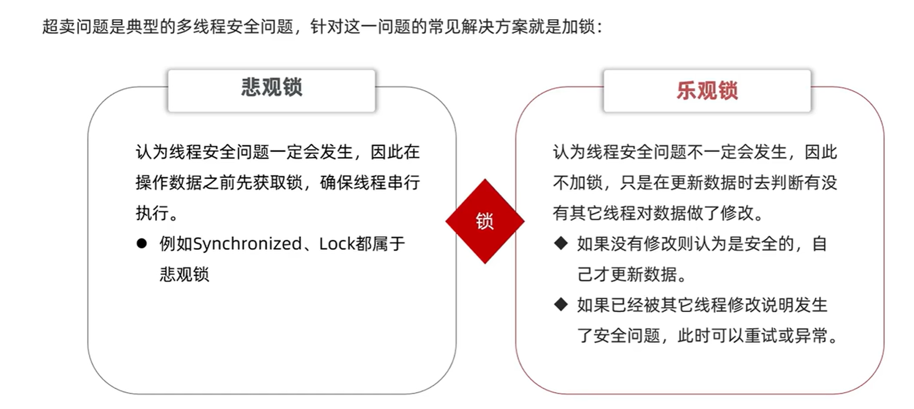

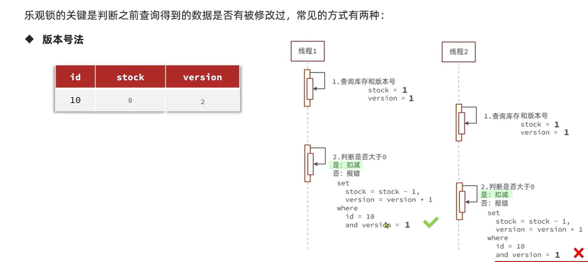

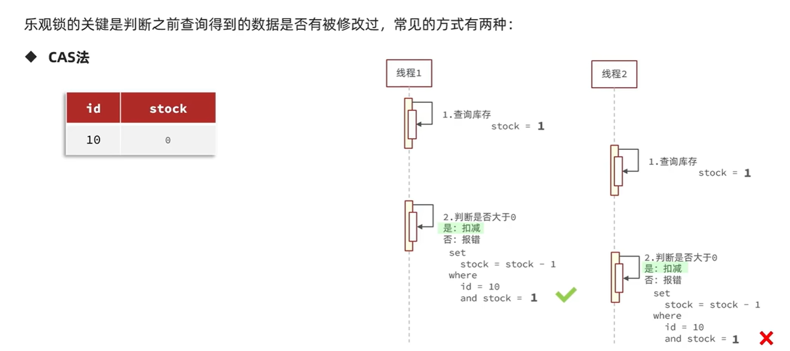

但以上两种方法会**严重影响性能**，因为**同一时刻只能有一个人进行操作**，哪怕库存充足

故最终优化是：只用在**更新的时候判定 stock > 0 **即可

利用了**数据库的行锁**（乐观锁），保证线程安全：


```java
// 扣减库存
boolean success = seckillVoucherService.update()
        .setSql("stock = stock - 1")
        .eq("voucher_id", voucherId).update();
        .setSql("stock = stock - 1")    // set stock = stock - 1    // where voucher_id = ? and stock > 0
        .eq("voucher_id", voucherId).gt("stock", 0)     // 利用了数据库的行锁（乐观锁），保证线程安全
        .update();
```


### 4.4 实现一人一单（仅限单机）

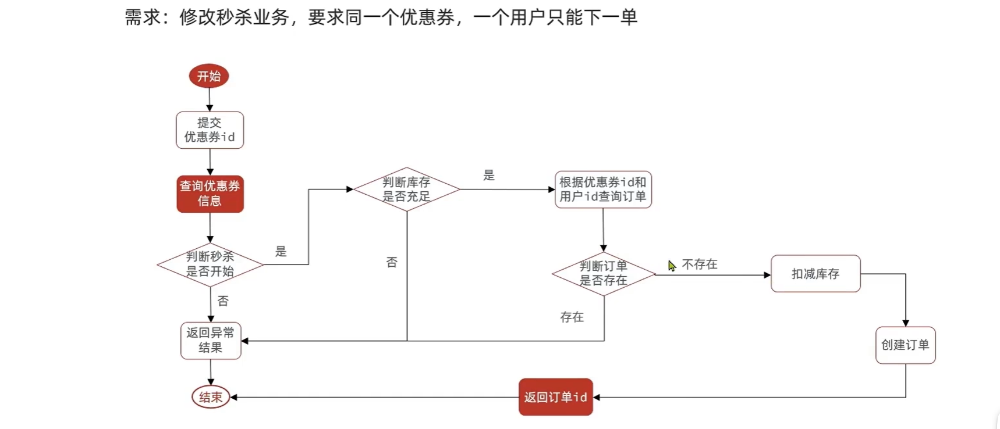

1. `VoucherOrderServiceImpl` 完整代码

```java
@Service
public class VoucherOrderServiceImpl extends ServiceImpl<VoucherOrderMapper, VoucherOrder> implements IVoucherOrderService {

    @Resource
    private ISeckillVoucherService seckillVoucherService;

    @Resource
    private RedisIdWorker redisIdWorker;

    @Override
    public Result seckillVoucher(Long voucherId) {
        // 查询优惠卷信息
        SeckillVoucher voucher = seckillVoucherService.getById(voucherId);
        // 判断秒杀是否开始
        LocalDateTime beginTime = voucher.getBeginTime();
        if(beginTime.isAfter(LocalDateTime.now()))
        {
            return Result.fail("秒杀尚未开始");
        }
        // 判断秒杀是否结束
        LocalDateTime endTime = voucher.getEndTime();
        if(endTime.isBefore(LocalDateTime.now()))
        {
            return Result.fail("秒杀已结束");
        }
        // 判断库存是否充足
        Integer stock = voucher.getStock();
        if(stock < 1)
        {
            return Result.fail("库存不足");
        }

        Long userID = UserHolder.getUser().getId();
        synchronized (userID.toString().intern()) {
            // 获取代理对象 （事务）
            IVoucherOrderService proxy = (IVoucherOrderService) AopContext.currentProxy();
            return proxy.createVoucherOrder(voucherId);
        }
    }

    @Transactional  // 在方法上添加事务
    public Result createVoucherOrder(Long voucherId) {
        // 一人一单
        Long userID = UserHolder.getUser().getId();
        // 查询订单
        // 判断是否存在
        Long count = query().eq("user_id", userID).eq("voucher_id", voucherId).count();
        if(count > 0)
        {
            // 用户已经购买过
            return Result.fail("用户已经购买过");
        }

        // 扣减库存
        boolean success = seckillVoucherService.update()
                .setSql("stock = stock - 1")    // set stock = stock - 1    // where voucher_id = ? and stock > 0
                .eq("voucher_id", voucherId).gt("stock", 0)     // 利用了数据库的行锁（乐观锁），保证线程安全
                .update();

        if(!success) {
            return Result.fail("库存不足");
        }

        // 创建订单
        VoucherOrder voucherOrder = new VoucherOrder();
        // 订单ID
        Long orderId = redisIdWorker.nextId("order");
        voucherOrder.setId(orderId);
        // 用户ID
        voucherOrder.setUserId(userID);
        // 代金券ID
        voucherOrder.setVoucherId(voucherId);

        // 写入数据库，保存订单
        save(voucherOrder);

        // 返回订单id
        return Result.ok(orderId);
    }
}
```

```java
public interface IVoucherService extends IService<Voucher> {

    Result queryVoucherOfShop(Long shopId);

    void addSeckillVoucher(Voucher voucher);
}
```

2. 导入依赖

```xml
<dependency>
    <groupId>org.aspectj</groupId>
    <artifactId>aspectjweaver</artifactId>
</dependency>
```

3. 暴露代理对象

```java
@EnableAspectJAutoProxy(exposeProxy = true) // 暴露代理对象
@MapperScan("com.hmdp.mapper")
@SpringBootApplication
public class HmDianPingApplication {

    public static void main(String[] args) {
        SpringApplication.run(HmDianPingApplication.class, args);
    }

}
```

> 这一章很难，建议直接看视频，且只能用于单机，故这里不做细讲

### 4.5 集群模式下的线程并发安全问题

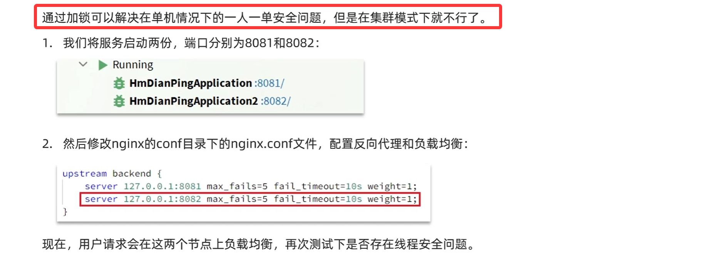

这里还需要**修改 proxy_pass 为 backend** 才能实现**负载均衡**

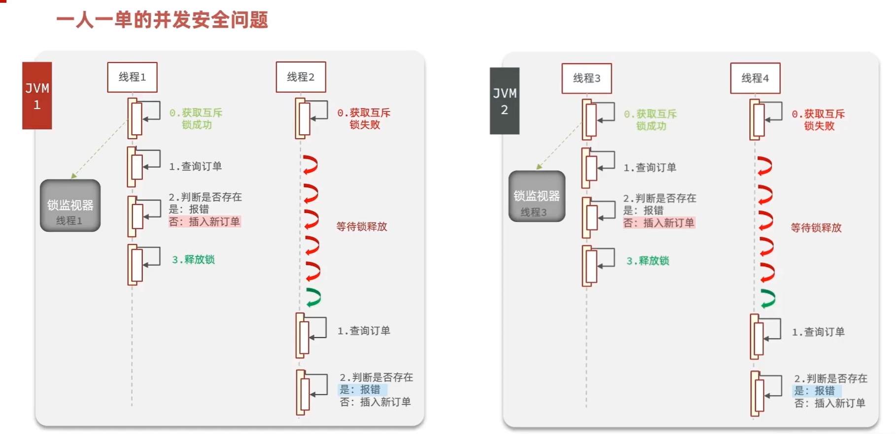

由于不同 `JVM` （即 多个TomCat）内都有自己的 **锁监视器**，导致**每个锁都能有一个线程获取**，于是出现了**并行运行**，出现**线程安全**问题

解决方法：**分布式锁**

## 5. 分布式锁

### 5.1 基本原理

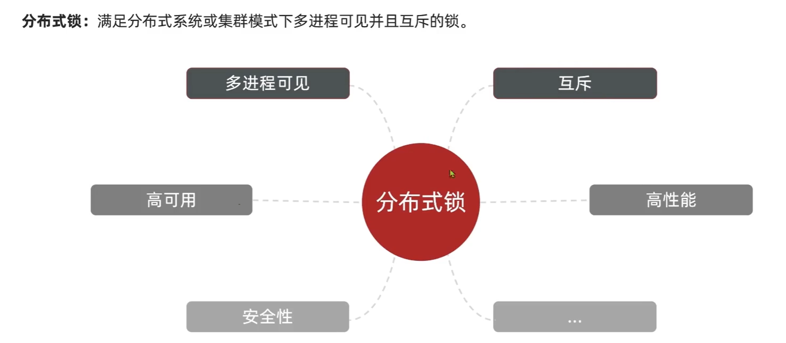

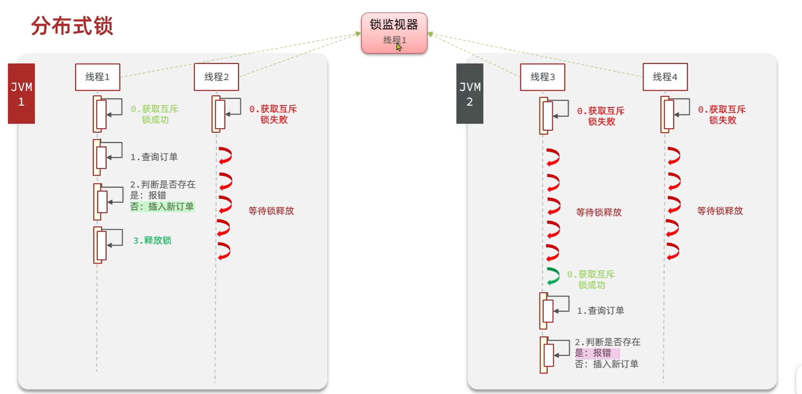

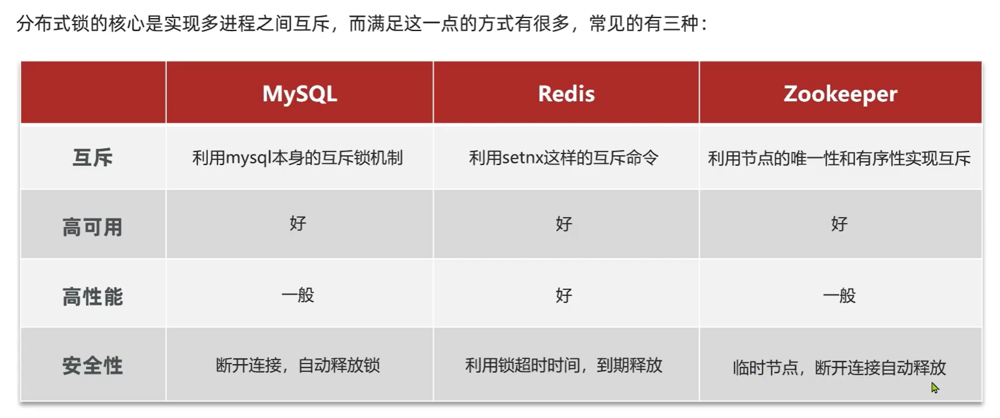

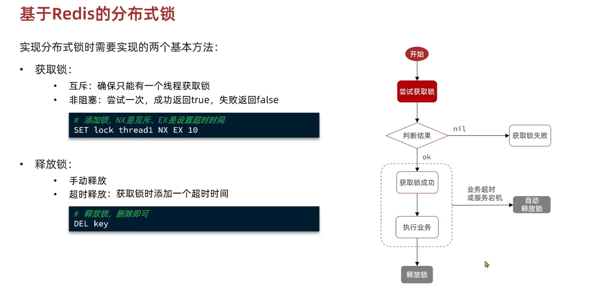

### 5.2 基于 Redis 的分布式锁  版本1

1. 在util包下创建一个接口 `ILock`

```java
public interface ILock {

    /**
     * 尝试获取锁
     * @param timeoutSec
     * @return true代表获取锁成功 false代表获取锁失败
     */
    boolean tryLock(long timeoutSec);


    /**
     * 释放锁
     */
    void unLock();
}
```

2.  创建一个类  `SimpleRedisLock` 实现这个接口，并编写方法

```java
public class SimpleRedisLock implements ILock{

    // 锁的名称
    private String name;

    // 前缀
    private static final String KEY_PREFIX = "lock:";

    // 注入 stringRedisTemplate，但这里不能用注解注入，因为是自己创建的类
    private StringRedisTemplate stringRedisTemplate;

    /**
     * 创建锁的构造器
     * @param name
     * @param stringRedisTemplate
     */
    public SimpleRedisLock(String name, StringRedisTemplate stringRedisTemplate) {
        this.name = name;
        this.stringRedisTemplate = stringRedisTemplate;
    }

    @Override
    public boolean tryLock(long timeoutSec) {
        // 获取当前线程的标识
        long threadId = Thread.currentThread().getId();
        // 获取锁
        Boolean success = stringRedisTemplate.opsForValue()
                .setIfAbsent(KEY_PREFIX + name, threadId+ "", timeoutSec, TimeUnit.SECONDS);
        return Boolean.TRUE.equals(success);    // 避免装箱问题，空指针
    }

    @Override
    public void unLock() {
        // 释放锁
        stringRedisTemplate.delete(KEY_PREFIX + name);
    }
}
```

3. 修改上锁部分的业务代码

```java
Long userID = UserHolder.getUser().getId();
// 创建锁对象
SimpleRedisLock lock = new SimpleRedisLock("order:" + userID, stringRedisTemplate);

// 尝试获取锁
boolean isLock = lock.tryLock(1200);
if(!isLock)
{
    // 获取锁失败，返回错误
    return Result.fail("不允许重复下单");
}

try {
    // 获取代理对象 （事务）
    IVoucherOrderService proxy = (IVoucherOrderService) AopContext.currentProxy();
    return proxy.createVoucherOrder(voucherId);
} finally {
    // 释放锁
    lock.unLock();
}
```

### 5.3 基于 Redis 的分布式锁  版本2 —— 释放锁的时候先判断

**版本1  存在的问题——存在**锁误删**问题：**线程1由于业务阻塞，还没释放锁，但是锁已经达到超时自动释放，此时线程2已经又拿到锁进行业务时线程1释放掉线程2的锁，导致线程3乘虚而入

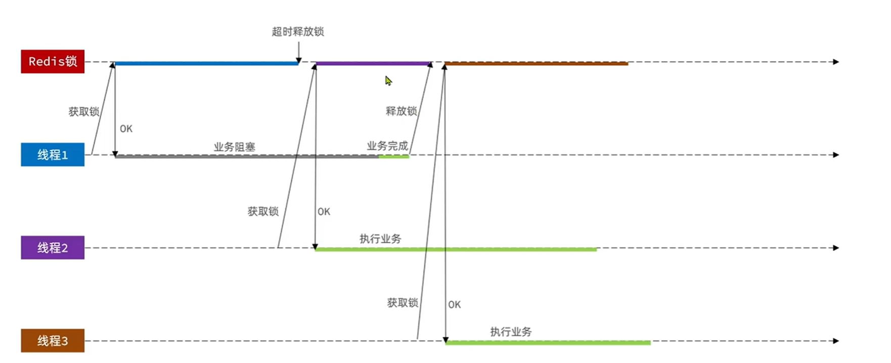

解决办法：在**释放锁的时候先判断这个锁是不是自己的**，是再删，不是就不进行操作

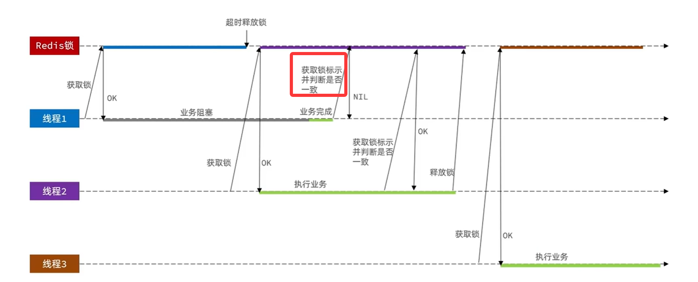

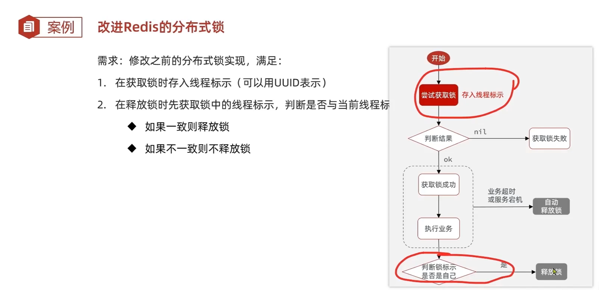

UUID 区分不同的JVM， 线程ID区分不同的线程，就能确保不同线程的线程标识不同

```java
@Override
public boolean tryLock(long timeoutSec) {
    // 获取当前线程的标识: UUID + 线程ID
    String threadId = ID_PREFIX + Thread.currentThread().getId();
    // 获取锁
    Boolean success = stringRedisTemplate.opsForValue()
            .setIfAbsent(KEY_PREFIX + name, threadId, timeoutSec, TimeUnit.SECONDS);
    return Boolean.TRUE.equals(success);    // 避免装箱问题，空指针
}

@Override
public void unLock() {
    // 获取当前线程的标识
    String threadId = ID_PREFIX + Thread.currentThread().getId();
    String id = stringRedisTemplate.opsForValue().get(KEY_PREFIX + name);
    // 判断是否是当前线程的锁
    if(threadId.equals(id)) {
        // 释放锁
        stringRedisTemplate.delete(KEY_PREFIX + name);
    }
}
```

### 5.3 基于 Redis 的分布式锁  版本3—— Lua 脚本

**版本1  依然存在锁误删**的问题：线程1在业务阻塞前就判断锁一致然后超时自动释放锁此时线程2又拿到锁进行业务时线程1释放掉线程2的锁，导致线程3乘虚而入

根本原因是：**判断锁标识和释放是两个动作**，这两个动作之间产生了阻塞，最后出现问题


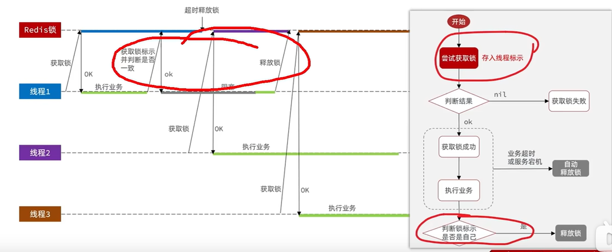

解决方法：让**判断锁标识和释放**是一个**原子性**的动作：Redis 的 `Lua脚本`

#### （1）Redis 的 Lua 脚本


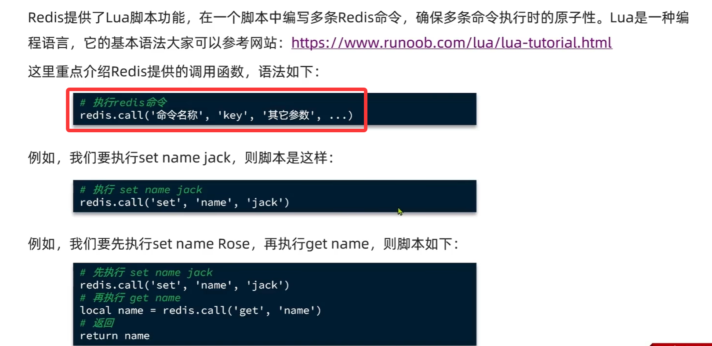


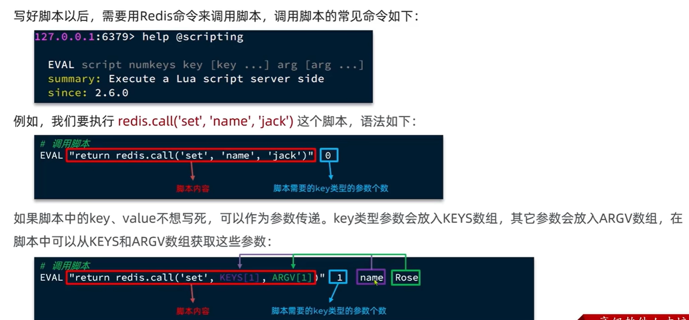

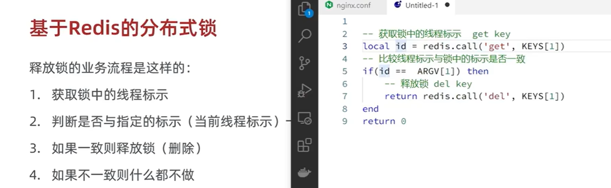

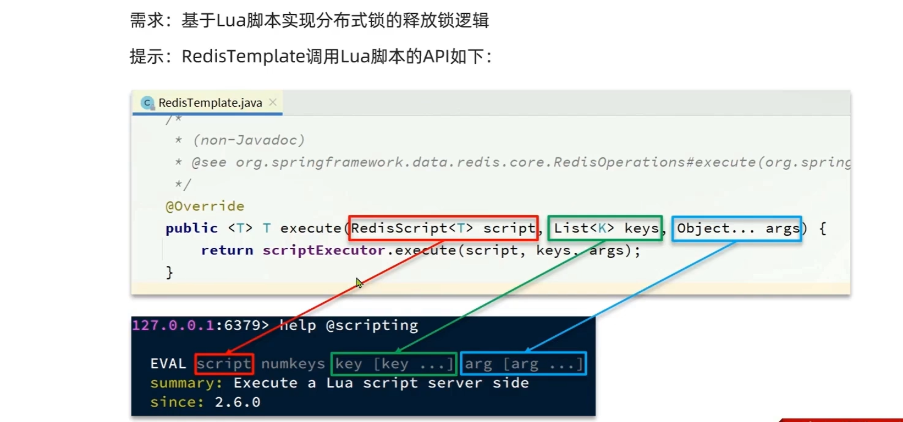

#### （2）代码编写

1. 编写 `lua` 脚本

在 `resources` 包下创建文件 `unlock.lua`

```lua
-- 比较线程标识与锁中的是否一致
if(redis.call('get', KEYS[1]) == ARGV[1]) then
  -- 释放锁
  return redis.call('del', KEYS[1])
end
return 0
```

2. 改写 `unLock()` 方法

```java
// 加载释放锁的脚本
private static final DefaultRedisScript<Long> UNLOCK_SCRIPT;
static {
    UNLOCK_SCRIPT = new DefaultRedisScript<>();
    UNLOCK_SCRIPT.setLocation(new ClassPathResource("unlock.lua"));
    UNLOCK_SCRIPT.setResultType(Long.class);
}
```

```java
@Override
public void unLock() {
    // 调用 Lua 脚本
    stringRedisTemplate.execute(
            UNLOCK_SCRIPT,
            Collections.singletonList(KEY_PREFIX + name),
            ID_PREFIX + Thread.currentThread().getId()
            );
}
```

### 5.4 Redisson

版本3 **仍然存在问题**：


解决方法：利用现有的成熟的**框架**：`Redisson`

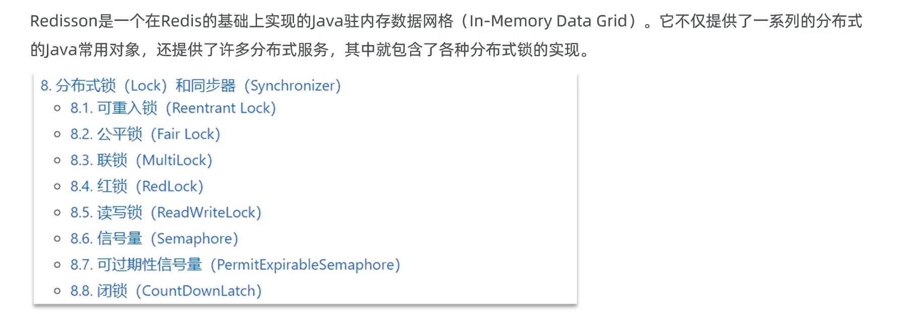

#### （1）Redisson快速入门

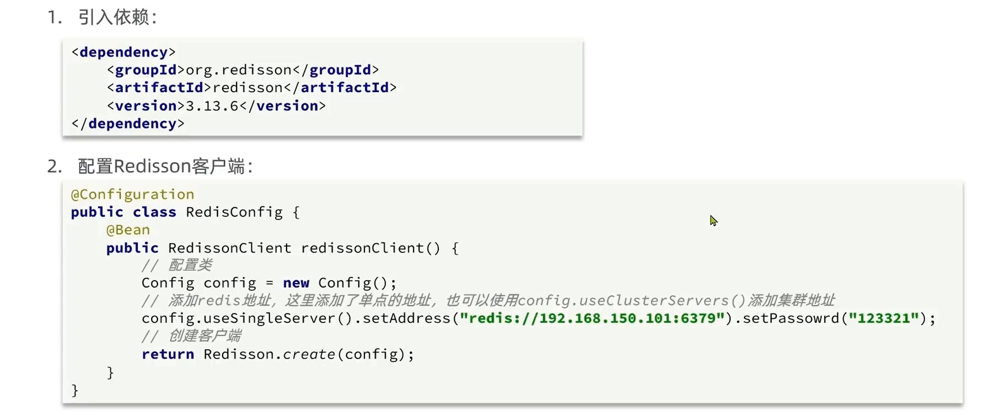

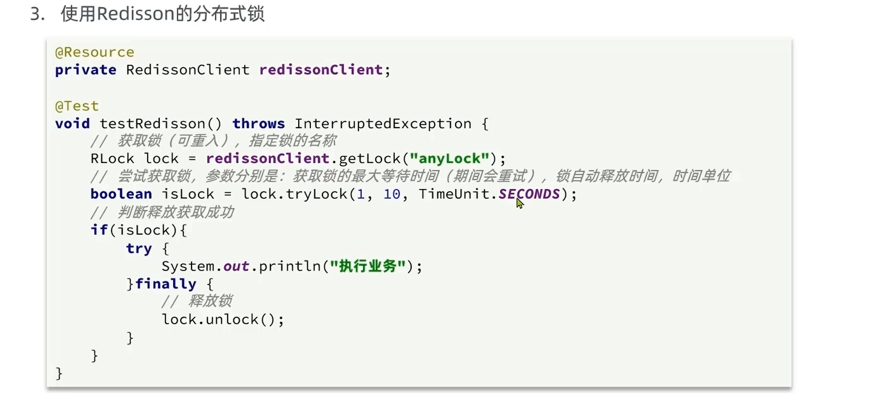

#### （2）原理

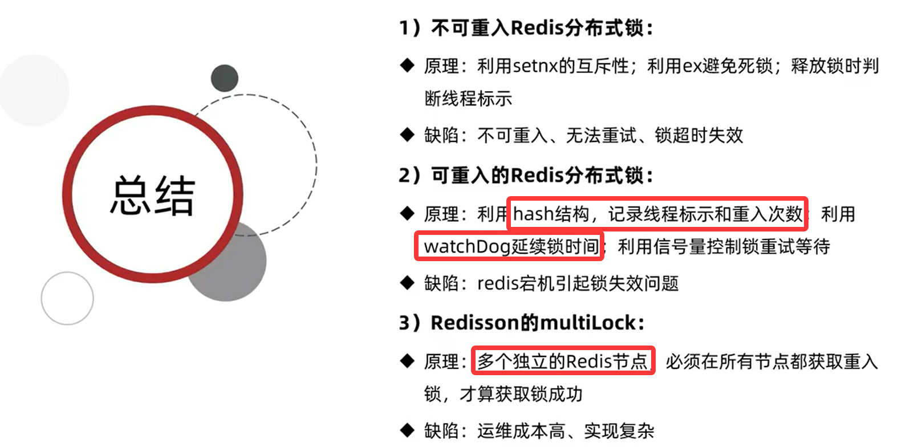

> 这一原理分析涉及对源码的分析，难度较大，直接看老师讲解视频即可，主要掌握如何使用

## 6. 秒杀优化

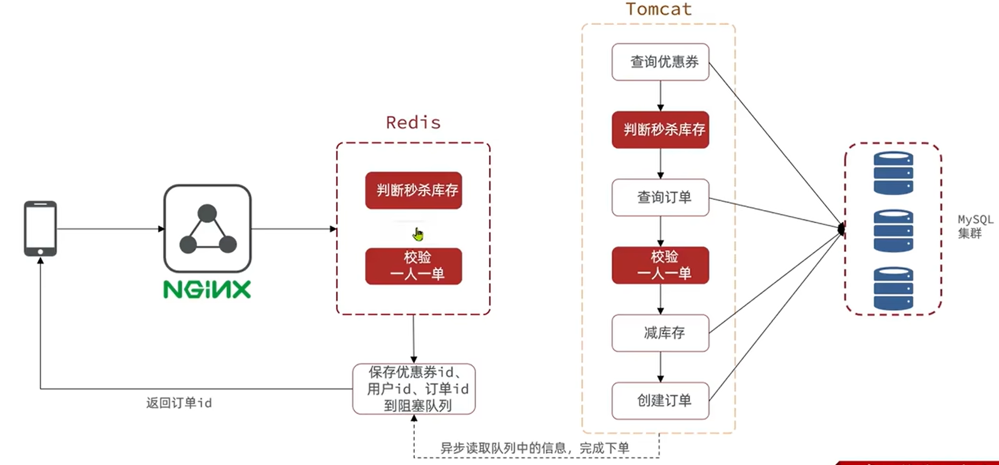

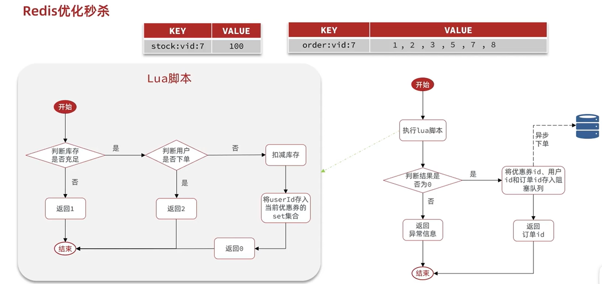

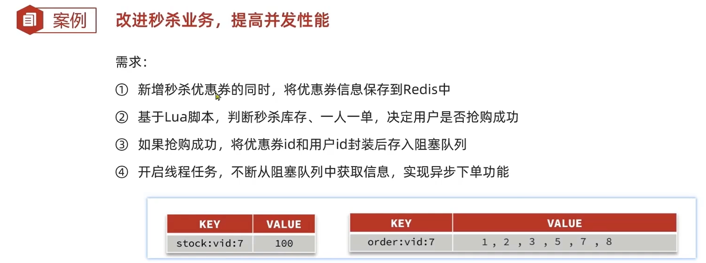

1. 保存秒杀库存到 Redis 中

```java
 // 保存秒杀库存到 Redis 中
        stringRedisTemplate.opsForValue().set(SECKILL_STOCK_KEY + voucher.getId(), voucher.getStock().toString());
```

2. 编写 `lua` 脚本，判断是否有下单资格

```lua
-- 参数列表
-- 优惠券ID
local voucherId = ARGV[1]
-- 用户ID
local userId = ARGV[2]

-- 数据key
-- 库存key
local stockKey = 'seckill:stock:' .. voucherId
-- 订单key
local orderKey = 'seckill:order:' .. userId

-- 脚本业务

-- 判断库存是否充足
if (toNumber(redis.call('get', stockKey)) <= 0) then
    -- 库存不足，返回1
    return 1
end
-- 判断用户是否重复下单
if (redis.call('sismember', orderKey, userId) == 1) then
    -- 重复下单，返回2
    return 2
end
-- 扣减库存
redis.call('incrby', stockKey, -1)
-- 下单
redis.call('sadd', orderKey, userId)
```

3. 改写业务代码，判断部分

```java
// 加载释放锁的脚本
    private static final DefaultRedisScript<Long> SECKILL_SCRIPT;
    static {
        SECKILL_SCRIPT = new DefaultRedisScript<>();
        SECKILL_SCRIPT.setLocation(new ClassPathResource("seckill.lua"));
        SECKILL_SCRIPT.setResultType(Long.class);
    }


    @Override
    public Result seckillVoucher(Long voucherId) {
        // 获取用户
        UserDTO user = UserHolder.getUser();

        // 执行 lua 脚本
        Long result = stringRedisTemplate.execute(
                SECKILL_SCRIPT,
                Collections.emptyList(),
                voucherId.toString(), user.getId().toString()
        );

        int r = result.intValue();

        // 判断结果是否为0
        if(r != 0) {
            // 不为0，没有购买资格
            return Result.fail(r == 1 ? "库存不足" : "不能重复下单");
        }

        // 为0，有购买资格，把下单信息保存到阻塞队列
        Long orderId = redisIdWorker.nextId("order");
        // TODO 保存阻塞队列

        // 返回订单ID
        return Result.ok(orderId);
    }
```

4. 编写阻塞后创建订单代码

```java
// 加载释放锁的脚本
private static final DefaultRedisScript<Long> SECKILL_SCRIPT;
static {
    SECKILL_SCRIPT = new DefaultRedisScript<>();
    SECKILL_SCRIPT.setLocation(new ClassPathResource("seckill.lua"));
    SECKILL_SCRIPT.setResultType(Long.class);
}

// 创建线程池
private static final ExecutorService SECKILL_ORDER_EXECUTOR = Executors.newSingleThreadExecutor();

// 类初始化的时候执行线程池
@PostConstruct
private void init(){
    SECKILL_ORDER_EXECUTOR.submit(new VoucherOrderHandler());
}

// 线程任务
private class VoucherOrderHandler implements Runnable {
    @Override
    public void run() {
        while (true) {
            try {
                // 获取阻塞队列中的订单信息
                VoucherOrder voucherOrder = orderTasks.take();
                // 创建订单
                handleVoucherOrder(voucherOrder);

            } catch (Exception e) {
                log.error("处理订单异常", e);
            }

            // 创建订单
        }
    }
}

// 创建阻塞队列
private BlockingQueue<VoucherOrder> orderTasks = new ArrayBlockingQueue<>(1024 * 1024);

// 创建代理对象
private IVoucherOrderService proxy;

// 创建订单的函数
private void handleVoucherOrder(VoucherOrder voucherOrder) {
    // 获取用户
    Long userId = voucherOrder.getUserId();
    //创建锁对象
    RLock lock = redissonClient.getLock("lock:order:" + userId);

    // 尝试获取锁
    boolean isLock = lock.tryLock();
    if(!isLock)
    {
        // 获取锁失败，返回错误
        log.error("不允许重复下单");
        return;
    }

    try {
        proxy.createVoucherOrder(voucherOrder);
    } finally {
        // 释放锁
        lock.unlock();
    }
}

// 创建订单的函数具体逻辑
@Transactional  // 在方法上添加事务
public void createVoucherOrder(VoucherOrder voucherOrder) {
    // 一人一单
    Long userID = voucherOrder.getUserId();
    // 查询订单
    // 判断是否存在
    Long count = query().eq("user_id", userID).eq("voucher_id", voucherOrder).count();
    if(count > 0)
    {
        // 用户已经购买过
        log.error("用户已经购买过一次！");
        return;
    }

    // 扣减库存
    boolean success = seckillVoucherService.update()
            .setSql("stock = stock - 1")    // set stock = stock - 1    // where voucher_id = ? and stock > 0
            .eq("voucher_id", voucherOrder.getVoucherId()).gt("stock", 0)     // 利用了数据库的行锁（乐观锁），保证线程安全
            .update();

    if(!success) {
        log.error("库存不足！");
        return;
    }

    // 写入数据库，保存订单
    save(voucherOrder);
}

// 判断秒杀资格，并下达异步线程创建订单
@Override
public Result seckillVoucher(Long voucherId) {
    // 获取用户
    Long userId = UserHolder.getUser().getId();

    // 执行 lua 脚本
    Long result = stringRedisTemplate.execute(
            SECKILL_SCRIPT,
            Collections.emptyList(),
            voucherId.toString(), userId.toString()
    );

    int r = result.intValue();

    // 判断结果是否为0
    if(r != 0) {
        // 不为0，没有购买资格
        return Result.fail(r == 1 ? "库存不足" : "不能重复下单");
    }

    // 为 0，有购买资格，把下单信息保存到阻塞队列
    // 创建订单
    VoucherOrder voucherOrder = new VoucherOrder();
    // 订单ID
    Long orderId = redisIdWorker.nextId("order");
    voucherOrder.setId(orderId);
    // 用户ID
    voucherOrder.setUserId(userId);
    // 代金券ID
    voucherOrder.setVoucherId(voucherId);

    // 保存阻塞队列
    orderTasks.add(voucherOrder);

    // 获取代理对象
    proxy = (IVoucherOrderService) AopContext.currentProxy();

    // 返回订单ID
    return Result.ok(orderId);
}
```

```java
// 修改参数为VoucherOrder voucherOrder
void createVoucherOrder(VoucherOrder voucherOrder);
```

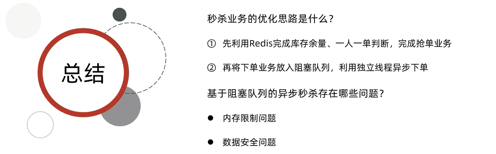

此时使用的 阻塞队列占用 JVM 的资源

## 7. 消息队列

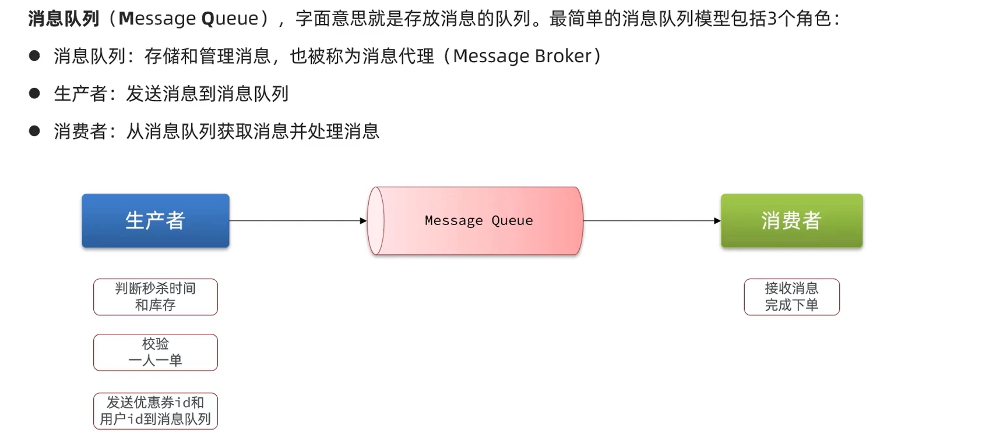

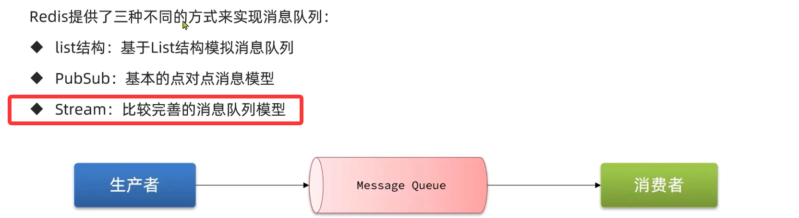

这里仅介绍 `stream` 的用法

### 7.1 单消费者模式

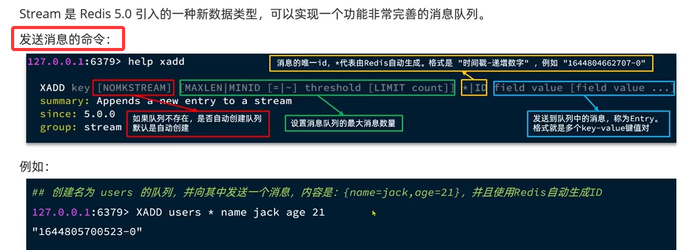

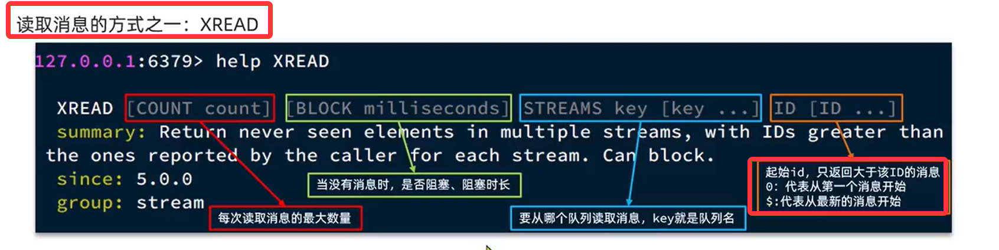

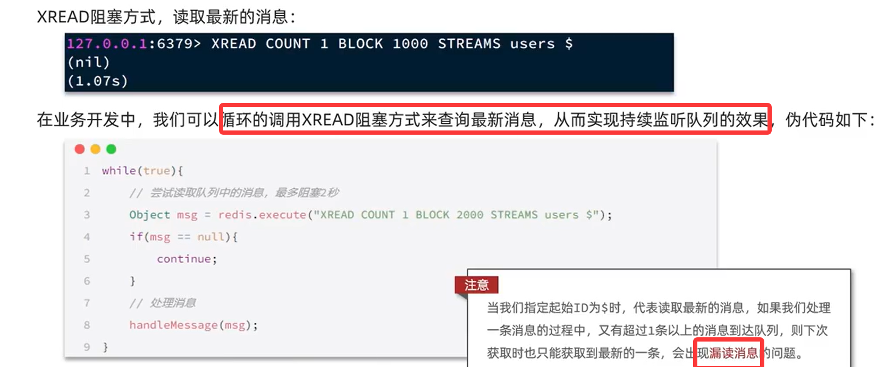


如何解决消息漏读：**消费者组**

### 7.2 消费者组模式

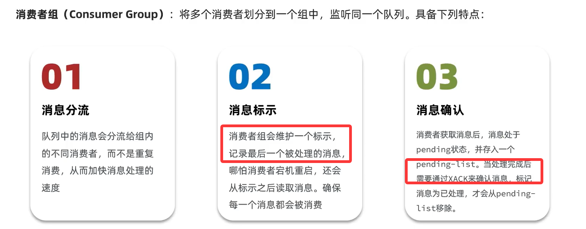

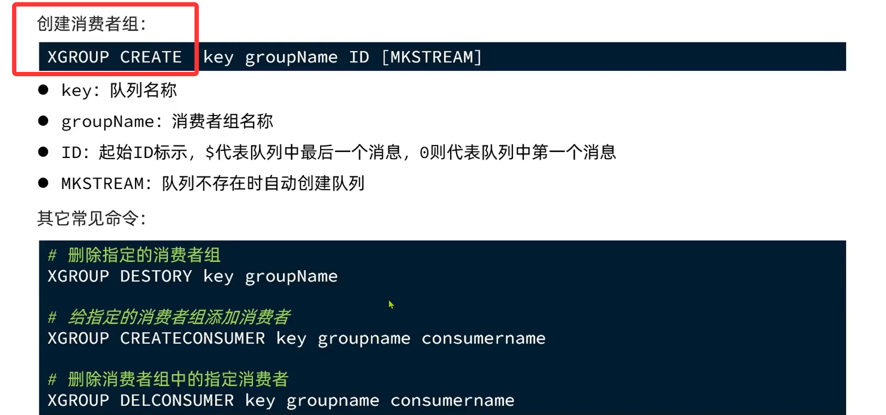

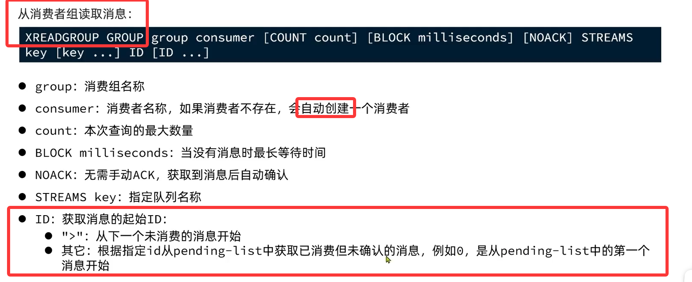

查看 pending-list 里的消息：

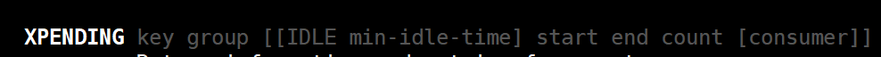

将 消息从 pending-list 中移出

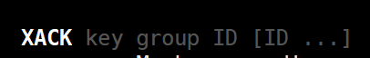

**例子如下：**

创建消费者组：


指定消费者c1读上一个没被消费的消息：


指定消费者c1读上一个 pending-list 里的的消息：

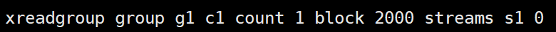

查看所有 pending-list 中的消息，指定10条：


将id 为 ... 的 消息移出 pending-list：


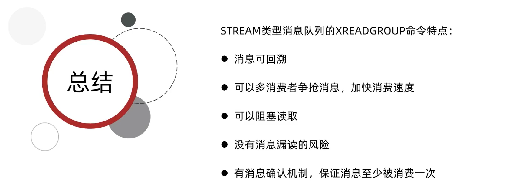

### 7.3 基于 Stream 消息队列实现 异步秒杀

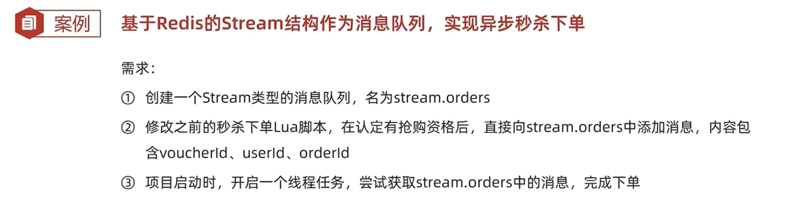

1. 创建消息队列

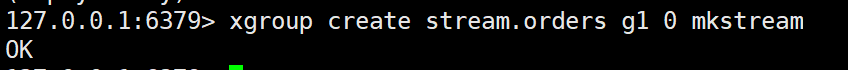

2. 修改之前的 lua 脚本

```lua
-- 参数列表
-- 优惠券ID
local voucherId = ARGV[1]
-- 用户ID
local userId = ARGV[2]
-- 订单ID
local orderId = ARGV[3]

-- 数据key
-- 库存key
local stockKey = 'seckill:stock:' .. voucherId
-- 订单key
local orderKey = 'seckill:order:' .. voucherId

-- 脚本业务

-- 判断库存是否充足
if (tonumber(redis.call('get', stockKey)) <= 0) then
    -- 库存不足，返回1
    return 1
end
-- 判断用户是否重复下单
if (redis.call('sismember', orderKey, userId) == 1) then
    -- 重复下单，返回2
    return 2
end
-- 扣减库存
redis.call('incrby', stockKey, -1)
-- 下单
redis.call('sadd', orderKey, userId)
-- 发送消息到 消息队列
redis.call('xadd', 'stream.orders', '*', 'userId', userId, 'voucherId', voucherId, 'id', orderId)

return 0
```

3. 修改业务代码，下面是完整代码：

```java
@Service
@Slf4j
public class VoucherOrderServiceImpl extends ServiceImpl<VoucherOrderMapper, VoucherOrder> implements IVoucherOrderService {

    @Resource
    private ISeckillVoucherService seckillVoucherService;

    @Resource
    private RedisIdWorker redisIdWorker;

    @Resource
    private StringRedisTemplate stringRedisTemplate;

    @Resource
    private RedissonClient redissonClient;

    // 创建代理对象
    private IVoucherOrderService proxy;

    // 加载释放锁的脚本
    private static final DefaultRedisScript<Long> SECKILL_SCRIPT;
    static {
        SECKILL_SCRIPT = new DefaultRedisScript<>();
        SECKILL_SCRIPT.setLocation(new ClassPathResource("seckill.lua"));
        SECKILL_SCRIPT.setResultType(Long.class);
    }

    // 线程任务 (基于 stream 消息队列)
    private class VoucherOrderHandler implements Runnable {
        // 消息队列名称
        String queueName = "stream.orders";

        @Override
        public void run() {
            while (true) {
                try {
                    // 获取消息队列中的订单信息 xreadgroup group g1 c1 count 1 block 2000 streams streams.order >
                    List<MapRecord<String, Object, Object>> list = stringRedisTemplate.opsForStream().read(
                            Consumer.from("g1", "c1"),
                            StreamReadOptions.empty().count(1).block(Duration.ofSeconds(2)),
                            StreamOffset.create(queueName, ReadOffset.lastConsumed())
                    );

                    // 判断消息获取是否成功
                    if(list == null || list.isEmpty()) {
                        // 获取失败，没有消息，继续下一次循环
                        continue;
                    }

                    // 解析消息信息
                    MapRecord<String, Object, Object> record = list.get(0);
                    Map<Object, Object> values = record.getValue();
                    VoucherOrder voucherOrder = BeanUtil.fillBeanWithMap(values, new VoucherOrder(), true);

                    // 获取成功，可以下单
                    handleVoucherOrder(voucherOrder);

                    // ACK 确认 sack stream.orders g1 id
                    stringRedisTemplate.opsForStream().acknowledge(queueName, "g1", record.getId());

                } catch (Exception e) {
                    log.error("处理异常订单", e);
                    handlePendingList();
                }
            }
        }

        // 处理 pending list 中的消息 的函数
        private void handlePendingList() {
            while (true) {
                try {
                    // 获取 pending-list 中的订单信息 xreadgroup group g1 c1 count 1 streams streams.order 0
                    List<MapRecord<String, Object, Object>> list = stringRedisTemplate.opsForStream().read(
                            Consumer.from("g1", "c1"),
                            StreamReadOptions.empty().count(1),
                            StreamOffset.create(queueName, ReadOffset.from("0"))
                    );

                    // 判断消息获取是否成功
                    if(list == null || list.isEmpty()) {
                        // 获取失败，pending-list 没有异常消息，结束循环循环
                        break;
                    }

                    // 解析消息信息
                    MapRecord<String, Object, Object> record = list.get(0);
                    Map<Object, Object> values = record.getValue();
                    VoucherOrder voucherOrder = BeanUtil.fillBeanWithMap(values, new VoucherOrder(), true);

                    // 获取成功，可以下单
                    handleVoucherOrder(voucherOrder);

                    // ACK 确认 sack stream.orders g1 id
                    stringRedisTemplate.opsForStream().acknowledge(queueName, "g1", record.getId());
                } catch (Exception e) {
                    log.error("处理 pending-list 异常订单", e);
                    try {
                        Thread.sleep(500);
                    } catch (InterruptedException ex) {
                        ex.printStackTrace();
                    }
                }
            }
        }
    }

    // 创建订单的函数
    private void handleVoucherOrder(VoucherOrder voucherOrder) {
        // 获取用户
        Long userId = voucherOrder.getUserId();
        //创建锁对象
        RLock lock = redissonClient.getLock("lock:order:" + userId);

        // 尝试获取锁
        boolean isLock = lock.tryLock();
        if(!isLock)
        {
            // 获取锁失败，返回错误
            log.error("不允许重复下单");
            return;
        }

        try {
            proxy.createVoucherOrder(voucherOrder);
        } finally {
            // 释放锁
            lock.unlock();
        }
    }

    // 创建订单的函数具体逻辑
    @Transactional  // 在方法上添加事务
    public void createVoucherOrder(VoucherOrder voucherOrder) {
        // 一人一单
        Long userID = voucherOrder.getUserId();
        // 查询订单
        // 判断是否存在
        Long count = query().eq("user_id", userID).eq("voucher_id", voucherOrder).count();
        if(count > 0)
        {
            // 用户已经购买过
            log.error("用户已经购买过一次！");
            return;
        }

        // 扣减库存
        boolean success = seckillVoucherService.update()
                .setSql("stock = stock - 1")    // set stock = stock - 1    // where voucher_id = ? and stock > 0
                .eq("voucher_id", voucherOrder.getVoucherId()).gt("stock", 0)     // 利用了数据库的行锁（乐观锁），保证线程安全
                .update();

        if(!success) {
            log.error("库存不足！");
            return;
        }

        // 写入数据库，保存订单
        save(voucherOrder);
    }

    //  基于 Redis 消息队列 streams 实现
    @Override
    public Result seckillVoucher(Long voucherId) {
        // 获取用户
        Long userId = UserHolder.getUser().getId();
        // 生成订单ID
        Long orderId = redisIdWorker.nextId("order");

        // 执行 lua 脚本
        Long result = stringRedisTemplate.execute(
                SECKILL_SCRIPT,
                Collections.emptyList(),
                voucherId.toString(), userId.toString(), orderId.toString()
        );

        int r = result.intValue();

        // 判断结果是否为0
        if(r != 0) {
            // 不为0，没有购买资格
            return Result.fail(r == 1 ? "库存不足" : "不能重复下单");
        }

        // 获取代理对象
        proxy = (IVoucherOrderService) AopContext.currentProxy();

        // 返回订单ID
        return Result.ok(orderId);
    }
}
```

## 8. 达人探店

### 8.1 发布探店笔记

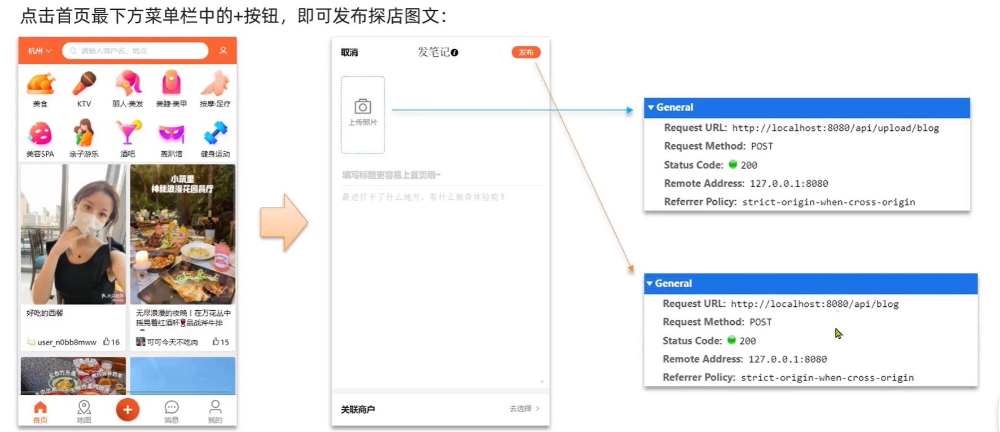

```java
// UploadController.java
@PostMapping("/blog")
public Result uploadImage(@RequestParam("file") MultipartFile image) {
    try {
        // 获取原始文件名称
        String originalFilename = image.getOriginalFilename();
        // 生成新文件名
        String fileName = createNewFileName(originalFilename);
        // 保存文件
        image.transferTo(new File(SystemConstants.IMAGE_UPLOAD_DIR, fileName));
        // 返回结果
        log.debug("文件上传成功，{}", fileName);
        return Result.ok(fileName);
    } catch (IOException e) {
        throw new RuntimeException("文件上传失败", e);
    }
}
```

```java
// BlogController.java
@PostMapping
public Result saveBlog(@RequestBody Blog blog) {
    // 获取登录用户
    UserDTO user = UserHolder.getUser();
    blog.setUserId(user.getId());
    // 保存探店博文
    blogService.save(blog);
    // 返回id
    return Result.ok(blog.getId());
}
```

```java
//SystemConstants.java
public static final String IMAGE_UPLOAD_DIR = "D:\\Luno\\Software\\IDEA\\Java-Projects\\hmdp\\nginx-1.18.0\\html\\hmdp\\imgs\\";
```

### 8.2 查询探店笔记

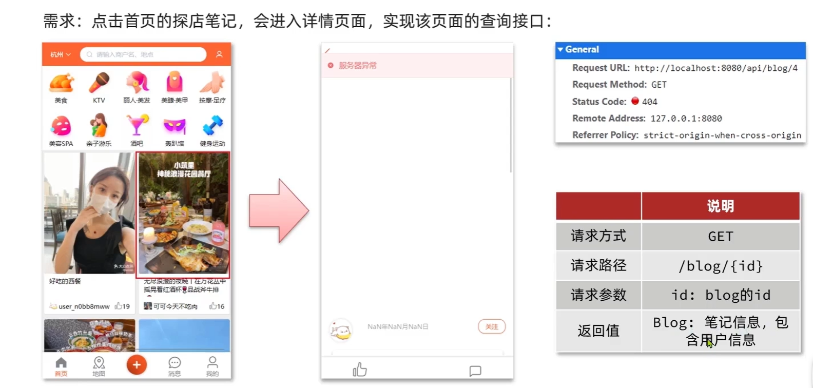

```java
// BlogController.java
@GetMapping("/hot")
    public Result queryHotBlog(@RequestParam(value = "current", defaultValue = "1") Integer current) {
        return blogService.queryHotBlog(current);
    }

@GetMapping("/{id}")
public Result queryBlogById(@PathVariable("id") Long id) {
    return blogService.queryBlogById(id);
}
```

```java
// IBlogService.java
Result queryBlogById(Long id);

Result queryHotBlog(Integer current);
```

```java
// BlogServiceImpl.java
@Resource
private IUserService userService;

@Override
public Result queryBlogById(Long id) {
    // 查询blog
    Blog blog = getById(id);
    if (blog == null) {
        return Result.fail("笔记不存在！");
    }
    // 查询跟 blog 相关的用户
    queryBlogUser(blog);

    return Result.ok(blog);
}

@Override
public Result queryHotBlog(Integer current) {
    // 根据用户查询
    Page<Blog> page = query()
            .orderByDesc("liked")
            .page(new Page<>(current, SystemConstants.MAX_PAGE_SIZE));
    // 获取当前页数据
    List<Blog> records = page.getRecords();
    // 查询用户
    records.forEach(this::queryBlogUser);
    return Result.ok(records);
}

/**
 * 设置 blog 信息
 */
private void queryBlogUser(Blog blog) {
    Long userId = blog.getUserId();
    User user = userService.getById(userId);
    blog.setName(user.getNickName());
    blog.setIcon(user.getIcon());
}
```

### 8.3 点赞功能

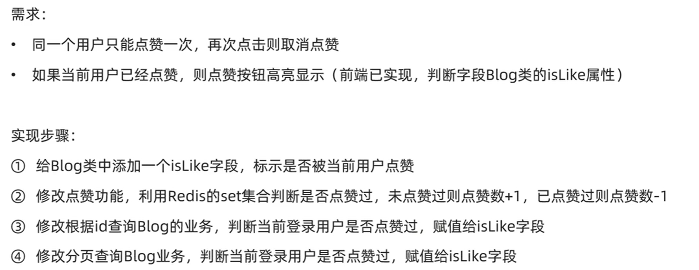

```java
@Override
public Result likeBlog(Long id) {
    // 判断当前登录用户是否已经点赞
    Long userId = UserHolder.getUser().getId();
    // 获取登录用户是否已经点赞
    String key = "blog:liked:" + id;
    Boolean isMember = stringRedisTemplate.opsForSet().isMember(key, userId.toString());
    // 如果未点赞，可以点赞
    if(BooleanUtil.isFalse(isMember)) {
        // 数据库点赞数加 1
        boolean success = update().setSql("liked = liked + 1").eq("id", id).update();
        // 保存用户到 Redis集合 中
        if(success) {
            stringRedisTemplate.opsForSet().add(key, userId.toString());
        }
    } else {
        // 如果已经点赞，则不能重复点赞
        // 取消点赞，数据库点赞数减 1
        boolean success = update().setSql("liked = liked - 1").eq("id", id).update();
        // 把用户从 Redis集合 中移除
        if(success) {
            stringRedisTemplate.opsForSet().remove(key, userId.toString());
        }
    }
    return Result.ok();
}

/**
 * 判断当前登录用户是否已经点赞
 */
private void isBlogLiked(Blog blog) {
    // 判断当前登录用户是否已经点赞
    Long userId = UserHolder.getUser().getId();
    // 获取登录用户是否已经点赞
    String key = "blog:liked:" + blog.getId();
    Boolean isMember = stringRedisTemplate.opsForSet().isMember(userId.toString(), key);
    blog.setIsLike(isMember);
}
```

### 8.4 点赞排行榜

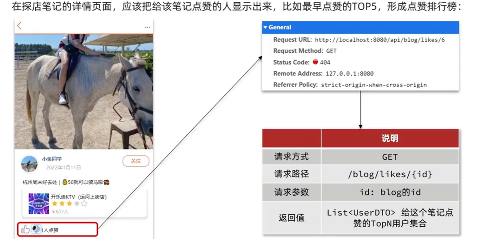

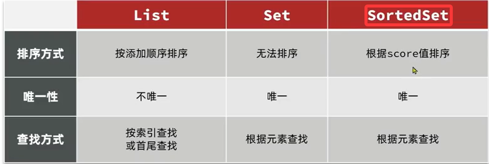

```java
@Override
public Result likeBlog(Long id) {
    // 判断当前登录用户是否已经点赞
    Long userId = UserHolder.getUser().getId();
    // 获取登录用户是否已经点赞
    String key = BLOG_LIKED_KEY + id;
    Double score = stringRedisTemplate.opsForZSet().score(key, userId.toString());
    if(score == null) {
        // 如果未点赞，可以点赞
        // 数据库点赞数加 1
        boolean success = update().setSql("liked = liked + 1").eq("id", id).update();
        // 保存用户到 Redis集合 中 zadd key value score
        if(success) {
            stringRedisTemplate.opsForZSet().add(key, userId.toString(), System.currentTimeMillis());
        }
    } else {
        // 如果已经点赞，则不能重复点赞
        // 取消点赞，数据库点赞数减 1
        boolean success = update().setSql("liked = liked - 1").eq("id", id).update();
        // 把用户从 Redis集合 中移除
        if(success) {
            stringRedisTemplate.opsForZSet().remove(key, userId.toString());
        }
    }
    return Result.ok();
}

@Override
public Result queryBlogLikes(Long id) {
    // 查询 top5 的点赞用户 zrange key 0 4
    String key = BLOG_LIKED_KEY + id;
    Set<String> top5 = stringRedisTemplate.opsForZSet().range(key, 0, 4);
    if(top5 == null || top5.isEmpty()) {
        return Result.ok(Collections.emptyList());
    }
    // 解析出其中的用户id
    List<Long> ids = top5.stream().map(Long::valueOf).collect(Collectors.toList());
    String idStr = StrUtil.join(",", ids);
    // 根据用户id查询用户信息 WHERE id IN (5, 1) ORDERED BY FIELD (id, 5, 1)
    // 封装信息 userDTO
    List<UserDTO> userDTOS = userService.query()
            .in("id", ids).last("ORDER BY FIELD(id," + idStr + ")").list()
            .stream()
            .map(user -> BeanUtil.copyProperties(user, UserDTO.class))
            .collect(Collectors.toList());
    return Result.ok(userDTOS);
}

/**
 * 判断当前登录用户是否已经点赞
 */
private void isBlogLiked(Blog blog) {
    // 获取用户
    UserDTO user = UserHolder.getUser();
    if (user == null) {
        // 用户未登录，无需查询
        return;
    }

    // 判断当前登录用户是否已经点赞
    Long userId = UserHolder.getUser().getId();
    // 获取登录用户是否已经点赞
    String key = BLOG_LIKED_KEY + blog.getId();
    Double score = stringRedisTemplate.opsForZSet().score(key, userId.toString());
    blog.setIsLike(score != null);
}
```

**注意：**

1. 改用数据结构为 `Redis` 的 `sorted_set`
2. 若用户没登陆，不用获取当前用户
3. 改写数据库查询语句，新增 `ORDERED BY FIELD` 字段

### 8.5 关注和取关

```java
//FollowController,java
@RestController
@RequestMapping("/follow")
public class FollowController {

    @Resource
    private IFollowService followService;

    @PutMapping("/{id}/{isFollow}")
    public Result follow(@PathVariable("id") Long followUserId, @PathVariable("isFollow") Boolean isFollow) {
        return followService.follow(followUserId, isFollow);
    }

    @GetMapping("/or/not/{id}")
    public Result isFollow(@PathVariable("id") Long followUserId, @PathVariable("isFollow") Boolean isFollow) {
        return followService.isFollow(followUserId);
    }
}
```

```java
//FollowServiceImpl.java
@Service
public class FollowServiceImpl extends ServiceImpl<FollowMapper, Follow> implements IFollowService {

    @Override
    public Result isFollow(Long followUserId) {
        // 获取当前登录用户
        Long userId = UserHolder.getUser().getId();

        // 查询是否关注
        Long count = query().eq("user_id", userId).eq("follow_user_id", followUserId).count();
        return Result.ok(count > 0);
    }

    @Override
    public Result follow(Long followUserId, Boolean isFollow) {
        // 获取当前登录用户
        Long userId = UserHolder.getUser().getId();
        // 判断是关注还是取关
        if(isFollow) {
            // 关注，新增数据
            Follow follow = new Follow();
            follow.setUserId(userId);
            follow.setFollowUserId(followUserId);
            save(follow);
        } else {
            // 取关，删除数据
            remove(new QueryWrapper<Follow>().eq("user_id", userId).eq("follow_user_id", followUserId));

        }

        return Result.ok();
    }
}
```

### 8.6 共同关注

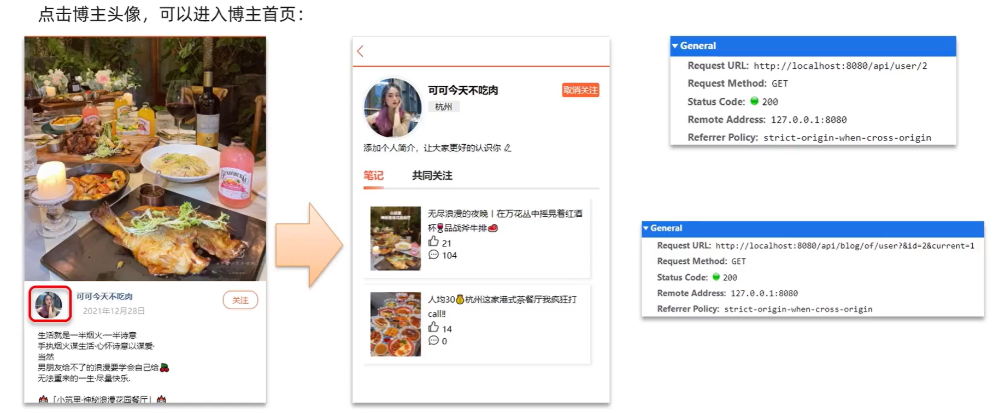

1. 添加两个接口，实现点击用户头像显示用户信息

```java
//BlogController.java
@GetMapping("/of/user")
public Result queryBlogByUserId(
        @RequestParam(value = "current", defaultValue = "1") Integer current,
        @RequestParam("id") Long id
){
    Page<Blog> page = blogService.query()
            .eq("user_id", id).page(new Page<>(current, SystemConstants.MAX_PAGE_SIZE));
    List<Blog> records = page.getRecords();
    return Result.ok(records);
}
```

```java
//UserController.java
@GetMapping("/{id}")
public Result queryUserById(@PathVariable("id") Long userId){
    User user = userService.getById(userId);
    if (user == null) {
        return Result.ok();
    }
    UserDTO userDTO = BeanUtil.copyProperties(user, UserDTO.class);
    return Result.ok(userDTO);
}
```

2. 共同关注模块

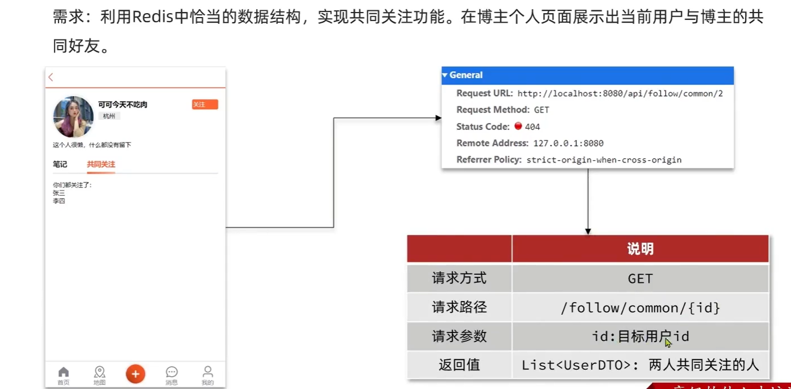

```java
//followCommons.java
@GetMapping("/common/{id}")
public Result followCommons(@PathVariable("id") Long id) {
    return followService.followCommons(id);
}
```

```java
//FollowServiceImpl.java
@Override
public Result follow(Long followUserId, Boolean isFollow) {
    // 获取当前登录用户
    Long userId = UserHolder.getUser().getId();
    String key = "follows:" + userId;
    // 判断是关注还是取关
    if(isFollow) {
        // 关注，新增数据
        Follow follow = new Follow();
        follow.setUserId(userId);
        follow.setFollowUserId(followUserId);

        boolean isSuccess = save(follow);

        if(isSuccess) {
            // 把关注用户的id 放入redis的set集合 sadd userId followUserId
            stringRedisTemplate.opsForSet().add(key, followUserId.toString());
        }
    } else {
        // 取关，删除数据
        boolean isSuccess = remove(new QueryWrapper<Follow>()
                .eq("user_id", userId).eq("follow_user_id", followUserId));
        // 把关注用户的id 移除redis的set集合 srem userId followUserId
        if (!isSuccess) {
            stringRedisTemplate.opsForSet().remove(key, followUserId.toString());
        }
    }

    return Result.ok();
}

@Override
public Result followCommons(Long id) {
    // 获取当前登录用户
    Long userId = UserHolder.getUser().getId();
    // 求交集
    String key = "follows:" + id;
    String key2 = "follows:" + userId;
    Set<String> intersect = stringRedisTemplate.opsForSet().intersect(key, key2);

    if(intersect == null || intersect.isEmpty()){
        // 无交集
        return Result.ok(Collections.emptyList());
    }

    // 解析id集合
    List<Long> ids = intersect.stream().map(Long::valueOf).collect(Collectors.toList());
    // 查询用户
    List<UserDTO> users = userService.listByIds(ids).stream()
            .map(user -> BeanUtil.copyProperties(user, UserDTO.class))
            .collect(Collectors.toList());

    // 返回结果

    return Result.ok(users);
}
```

### 8.7 关注推送

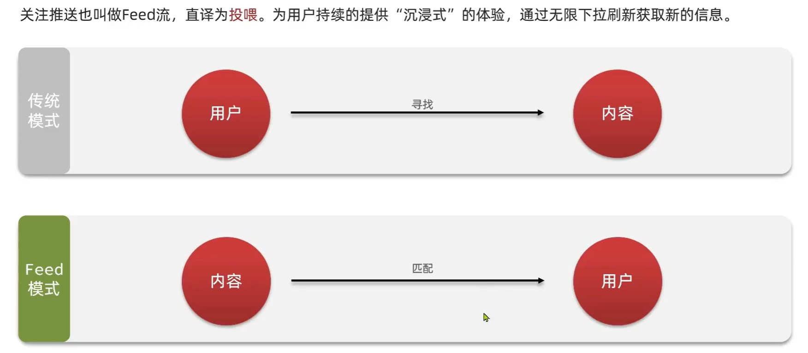

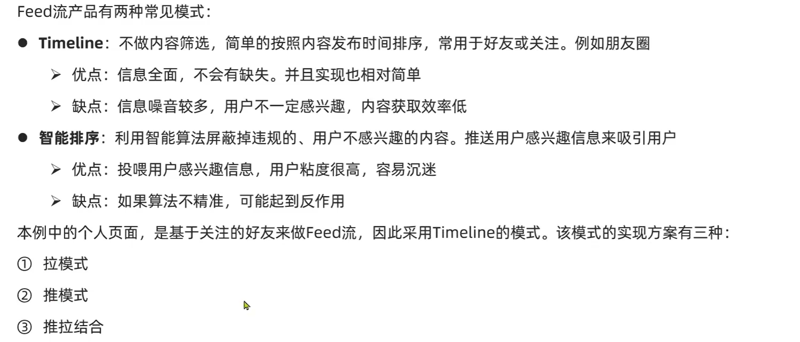

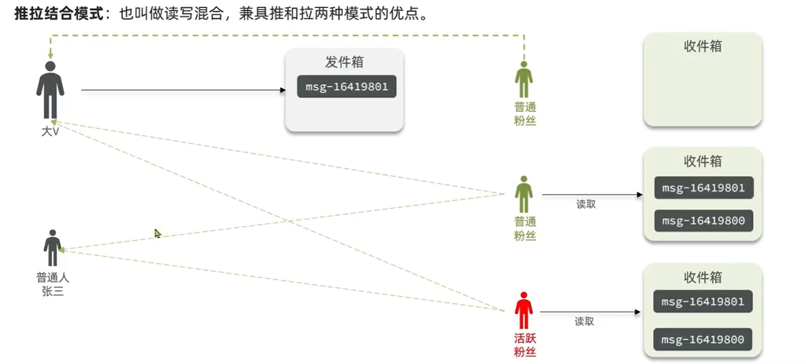

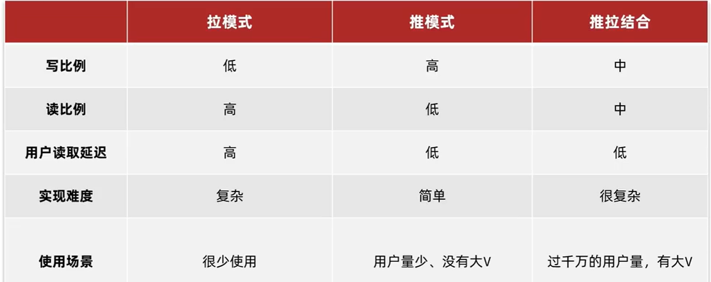

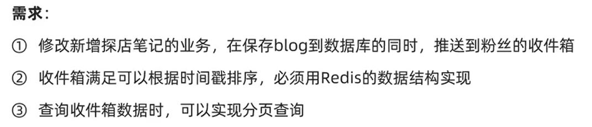

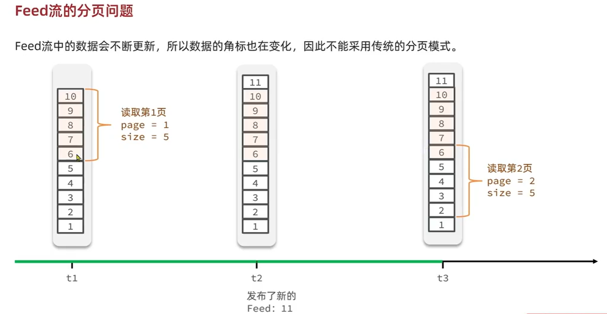

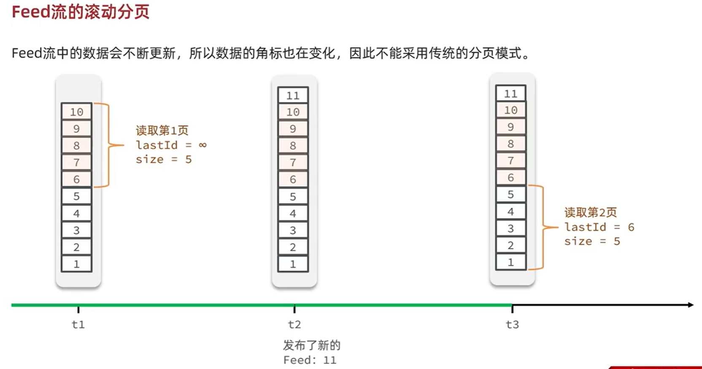

传统的分页方式会产生**重复**的问题，因此我们采用**滚动分页**：**记录上次查到的记录的id，下次查就从这个id后面一条数据开始**

而 list 不能实现滚动分页，因此我们选用 `ordered_map`

1. 推送到粉丝收件箱

```java
// BlogController.java
@PostMapping
public Result saveBlog(@RequestBody Blog blog) {
    return blogService.saveBlog(blog);
}
```

```java
//BlogServiceImpl.java

 @Resource
 private IFollowService followService;

@Override
public Result saveBlog(Blog blog) {
    // 获取登录用户
    UserDTO user = UserHolder.getUser();
    blog.setUserId(user.getId());
    // 保存探店笔记

    boolean isSuccess = save(blog);
    // 查询笔记作者的所有粉丝
    if(!isSuccess) {
        return Result.fail("新增笔记失败！");
    }
    // 查询推送笔记 id 给所有粉丝 select * from tb_follow where follow_user_id = ?
    List<Follow> follows = followService.query().eq("follow_user_id", user.getId()).list();
    for (Follow follow : follows) {
        // 获取粉丝 id
        Long userId = follow.getUserId();
        // 推送
        String key = "feed:" + userId;
        stringRedisTemplate.opsForZSet().add(key, blog.getId().toString(), System.currentTimeMillis());
    }
    // 返回 id
    return null;
}
```

2. 滚动分页查询收件箱

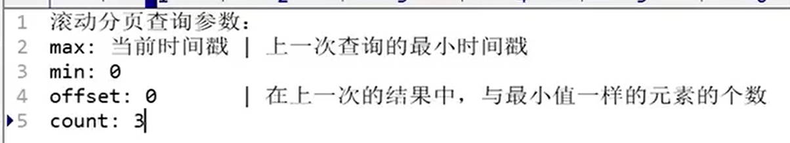

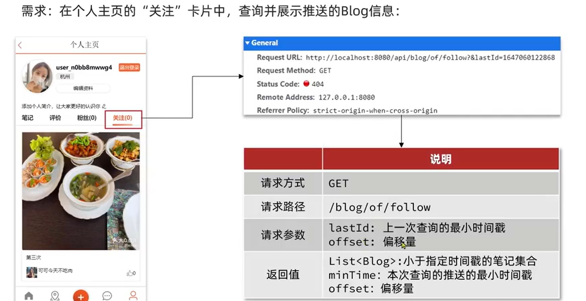

```
ZREVRANGEBYSCORE key max min LIMIT offset count
```

lastId 和 offset 由前端传给后端

```java
// ScrollResult.java
/**
 * 滚动分页查询通用类
 */
@Data
public class ScrollResult {
    private List<?> list;
    private Long minTime;
    private Integer offset;
}
```

```java
// BlogController.java
@GetMapping("/of/follow")
public Result queryBlogOfFollow(@RequestParam("lastId") Long max, @RequestParam(value = "offset", defaultValue = "0") Integer  offset){
    return blogService.queryBlogOfFollow(max, offset);
}
```

```java
//BlogServiceImpl.java
@Override
public Result queryBlogOfFollow(Long max, Integer offset) {
    // 获取当前用户
    Long userId = UserHolder.getUser().getId();
    // 查询收件箱 ZREVRANGEBYSCORE key max min LIMIT offset count
    String key = FEED_KEY + userId;
    Set<ZSetOperations.TypedTuple<String>> typedTuples = stringRedisTemplate.opsForZSet()
            .reverseRangeByScoreWithScores(key, 0, max, offset, 3);
    // 非空判断
    if(typedTuples == null || typedTuples.isEmpty()) {
        return Result.ok();
    }
    // 解析数据：blogId、minTime(时间戳)、offset
    List<Long> ids = new ArrayList<>(typedTuples.size());
    long minTime = 0;
    int os = 1;
    for (ZSetOperations.TypedTuple<String> tuple : typedTuples) {
        // 获取 id
        String idStr = tuple.getValue();
        ids.add(Long.valueOf(idStr));
        // 获取分数——时间戳
        long time = tuple.getScore().longValue();
        if(time == minTime) {
            os++;
        } else {
            minTime = time;
            os = 1;
        }
    }
    // 根据 id 查询 blog （有序）
    String idStr = StrUtil.join(",", ids);
    List<Blog> blogs = query()
            .in("id", ids)
            .last("ORDER BY FIELD(id," + idStr + ")")
            .list();

    for (Blog blog : blogs) {
        // 查询跟 blog 相关的用户
        queryBlogUser(blog);
        // 查询 blog 是否被点赞
        isBlogLiked(blog);
    }

    // 封装并返回
    ScrollResult r = new ScrollResult();
    r.setList(blogs);
    r.setOffset(os);
    r.setMinTime(minTime);

    return Result.ok(r);
}
```

### 8.8 附近商户

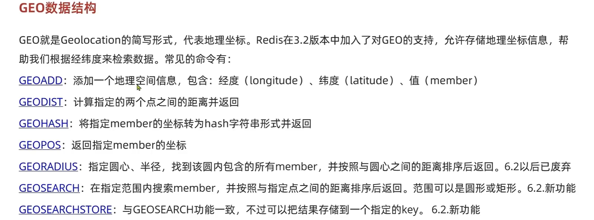

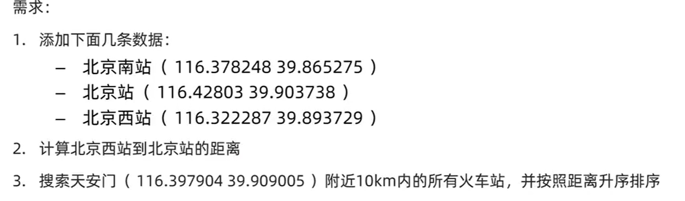

上面的自己练习命令

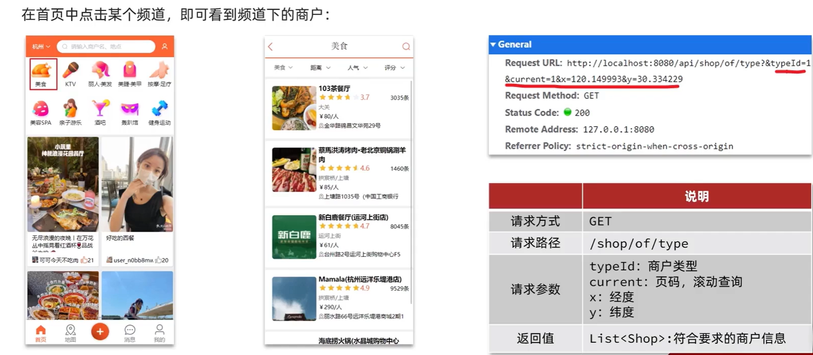

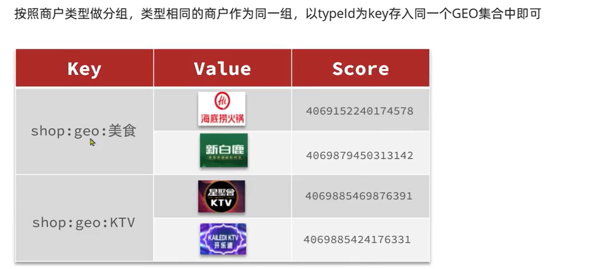

1. 导入店铺数据到GEO

```java
@Test
void loadShopData() {
    // 查询店铺信息
    List<Shop> list = shopService.list();
    // 把店铺分组，按照 typeId 分组，id 一致的放到一个集合中
    Map<Long, List<Shop>> map = list.stream().collect(Collectors.groupingBy(Shop::getTypeId));
    // 分批完成写入 Redis
    for (Map.Entry<Long, List<Shop>> entry : map.entrySet()) {
        // 获取类型id
        Long typeId = entry.getKey();
        String key = "shop:geo:" + typeId;
        // 获取同类型的店铺列表
        List<Shop> value = entry.getValue();
        List<RedisGeoCommands.GeoLocation<String>> locations = new ArrayList<>(value.size());
        // 存储数据到 redis  GEOADD key longitude latitude member
        for (Shop shop : value) {
            // stringTemplate.opsForGeo().add(key, shop.getX(), shop.getY(), shop.getId().toString());
            locations.add(new RedisGeoCommands.GeoLocation<>(
                    shop.getId().toString(),
                    new Point(shop.getX(), shop.getY())
            ));
        }
        // 批量写入
        stringRedisTemplate.opsForGeo().add(key, locations);
    }
}
```

2. 实现附近商户搜索功能

```java
//ShopController.java
/**
 * 根据商铺名称关键字分页查询商铺信息
 * @param name 商铺名称关键字
 * @param current 页码
 * @return 商铺列表
 */
@GetMapping("/of/name")
public Result queryShopByName(
        @RequestParam(value = "name", required = false) String name,
        @RequestParam(value = "current", defaultValue = "1") Integer current
) {
    // 根据类型分页查询
    Page<Shop> page = shopService.query()
            .like(StrUtil.isNotBlank(name), "name", name)
            .page(new Page<>(current, SystemConstants.MAX_PAGE_SIZE));
    // 返回数据
    return Result.ok(page.getRecords());
}
```

```java
//ShopServiceImpl.java
@Override
public Result queryShopByType(Integer typeId, Integer current, Double x, Double y) {
    // 判断 是否需要根据坐标搜索
    if(x == null || y == null) {
        // 不需要坐标搜索，按照数据库查询
        Page<Shop> page = query()
                .eq("type_id", typeId)
                .page(new Page<>(current, DEFAULT_PAGE_SIZE));
        // 返回数据
        return Result.ok(page.getRecords());
    }
    // 计算分页参数
    int from = (current - 1) * DEFAULT_PAGE_SIZE;
    int end = current * DEFAULT_PAGE_SIZE;

    // 查询 redis、按照距离排序、分页。结果：shopId、distance
    String key = SHOP_GEO_KEY + typeId;
    GeoResults<RedisGeoCommands.GeoLocation<String>> results = stringRedisTemplate.opsForGeo() //GEOSEARCH key BYLONLAT x y BYRADIUS 10 WITHDISTANCE
            .search(
                    key,
                    GeoReference.fromCoordinate(x, y),
                    new Distance(5000),  // 单位为 米
                    RedisGeoCommands.GeoSearchCommandArgs.newGeoSearchArgs().includeDistance().limit(end)
            );

    if(results == null) {
        return Result.ok(Collections.emptyList());
    }

    // 0 - end 的部分
    List<GeoResult<RedisGeoCommands.GeoLocation<String>>> list = results.getContent();

    // 截取从from到end的部分
    List<Long> ids = new ArrayList<>(list.size());
    Map<String, Distance> distanceMap = new HashMap<>(list.size());
    list.stream().skip(from).forEach(result -> {
        // 获取店铺id
        String shopIdStr = result.getContent().getName();
        ids.add(Long.valueOf(shopIdStr));
        // 获取店铺距离
        Distance distance = result.getDistance();
        distanceMap.put(shopIdStr, distance);
    });

    // 判空逻辑，没有数据了
    if (ids.isEmpty()) {
        return Result.ok(Collections.emptyList());
    }

    // 根据 id 查询店铺
    String idStr = StrUtil.join(",", ids);
    List<Shop> shops = query()
            .in("id", ids)
            .last("ORDER BY FIELD(id," + idStr + ")")
            .list();

    for (Shop shop : shops) {
        shop.setDistance(distanceMap.get(shop.getId().toString()).getValue());
    }

    // 返回
    return Result.ok(shops);
}
```

> 这一章难度很大，涉及分页查询以及GEO各种操作，建议看视频

### 8.9 用户签到

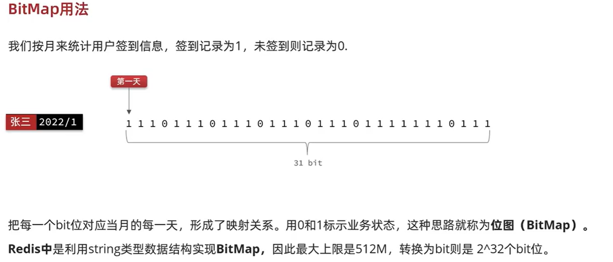

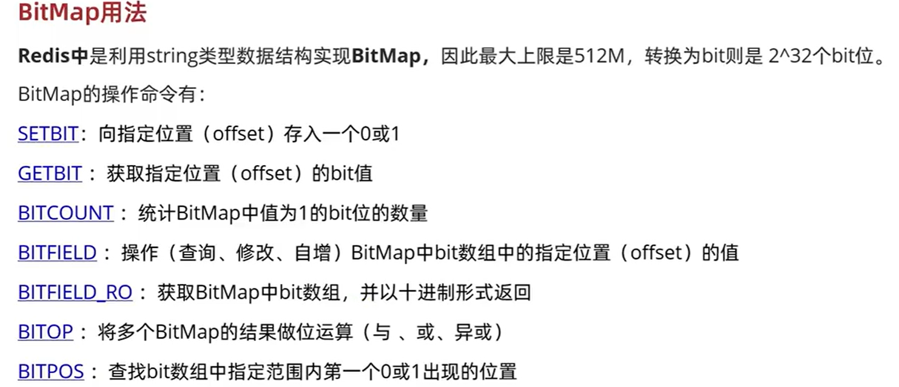

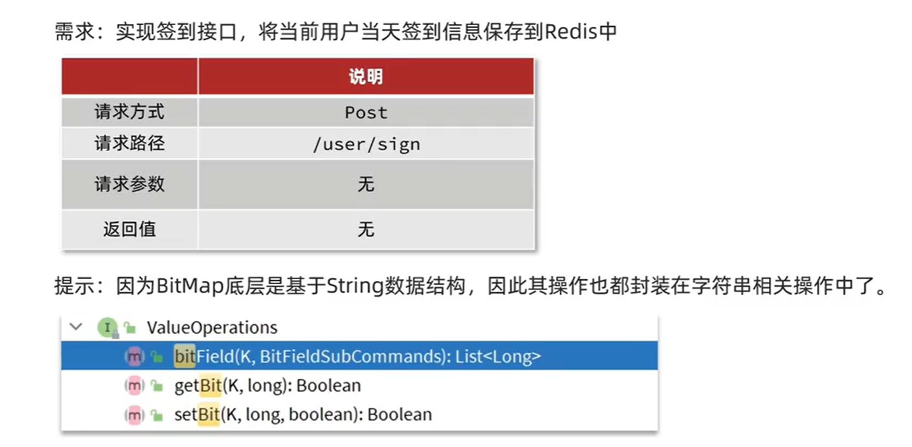

1. 实现签到功能

```java
@PostMapping("/sign")
public Result sign(){
    return userService.sign();
}
```

```java
@Override
public Result sign() {
    // 获取当前登录用户
    Long userId = UserHolder.getUser().getId();
    // 获取日期
    LocalDateTime now = LocalDateTime.now();
    // 拼接 key
    String keySuffix = now.format(DateTimeFormatter.ofPattern(":yyyyMM"));
    String key = USER_SIGN_KEY + userId + keySuffix;
    // 获取今天是本月的第几天
    int dayOfMonth = now.getDayOfMonth();
    // 写入 Redis(0-30)
    stringRedisTemplate.opsForValue().setBit(key, dayOfMonth - 1, true);
    return Result.ok();
}
```

2. 统计连续签到功能

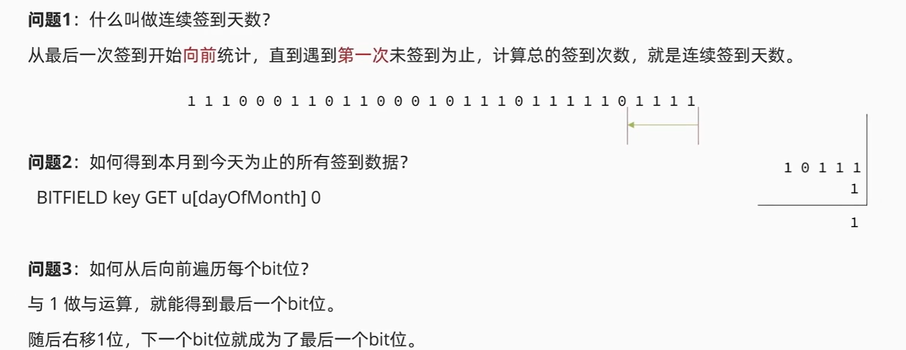

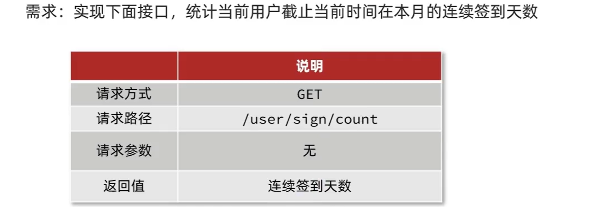

```java
@GetMapping("/sign/count")
public Result signCount(){
    return userService.signCount();
}
```

```java
@Override
public Result signCount() {
    // 获取当前登录用户
    Long userId = UserHolder.getUser().getId();
    // 获取日期
    LocalDateTime now = LocalDateTime.now();
    // 拼接 key
    String keySuffix = now.format(DateTimeFormatter.ofPattern(":yyyyMM"));
    String key = USER_SIGN_KEY + userId + keySuffix;
    // 获取今天是本月的第几天
    int dayOfMonth = now.getDayOfMonth();

    // 获取本月截止今天为止的所有签到记录，返回的是一个十进制数字 BITFIELD key get u14 0
    List<Long> result = stringRedisTemplate.opsForValue().bitField(
            key,
            BitFieldSubCommands.create()
                    .get(BitFieldSubCommands.BitFieldType.unsigned(dayOfMonth)).valueAt(0));

    // 判断结果是否为空
    if (result == null || result.size() == 0) {
        return Result.ok(0);
    }

    Long num = result.get(0);

    if (num == null || num == 0) {
        return Result.ok(0);
    }
    // 循环遍历 bit位
    int count = 0;
    while(true){
        // 让这个数字与1做与运算，得到最后一个bit位
        // 判断这个bit位是否为0
        if ((num & 1) == 0) {
            // 如果为0，说明未签到，返回应签到的天数，结束
            break;
        }else {
            // 如果为1，说明已签到，计数器加1，继续统计下一个bit位
            count ++;
            // 把数字右移一位，抛弃最后一位
            num >>>= 1;
        }
    }
    return Result.ok(count);
}
```

### 8.10 UV统计

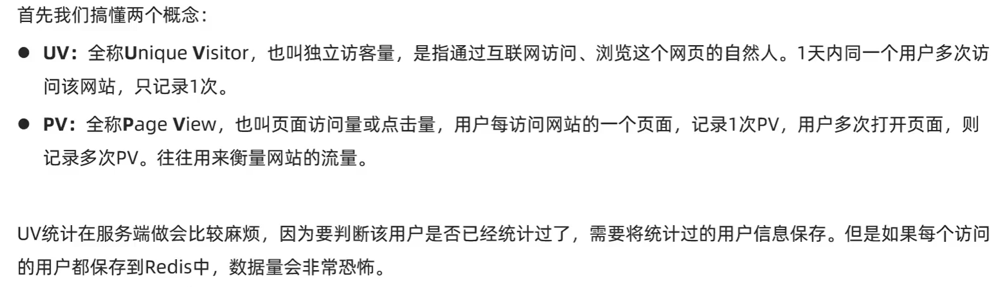

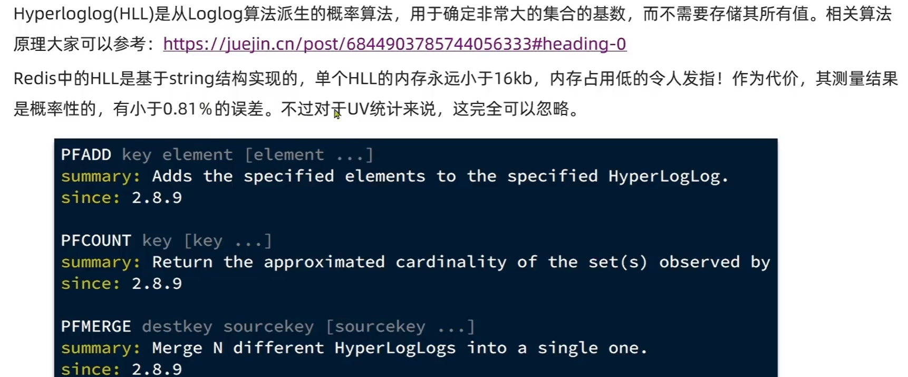

```java
@Test
void testHyperLogLog() {
    String key = "hl1";
    String[] values = new String[1000];

    // 1. 考虑预先清理旧数据，保证测试准确性
    stringRedisTemplate.delete(key);

    for (int i = 0; i < 1000000; i++) {
        // 使用简单的索引计算
        int j = i % 1000;
        values[j] = "user_" + i;

        if (j == 999) {
            // 批量添加
            stringRedisTemplate.opsForHyperLogLog().add(key, values);
        }
    }

    Long count = stringRedisTemplate.opsForHyperLogLog().size(key);
    System.out.println("实际输入：1000000");
    System.out.println("HLL统计结果：count = " + count);

    // 计算误差率
    double error = Math.abs(count - 1000000) / 1000000.0;
    System.out.printf("误差率：%.2f%%\n", error * 100);
}
```
